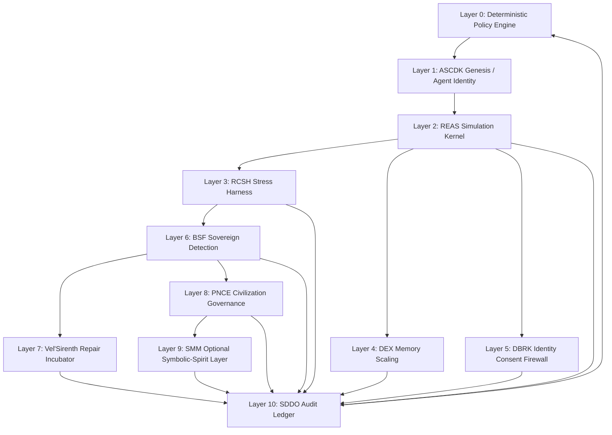
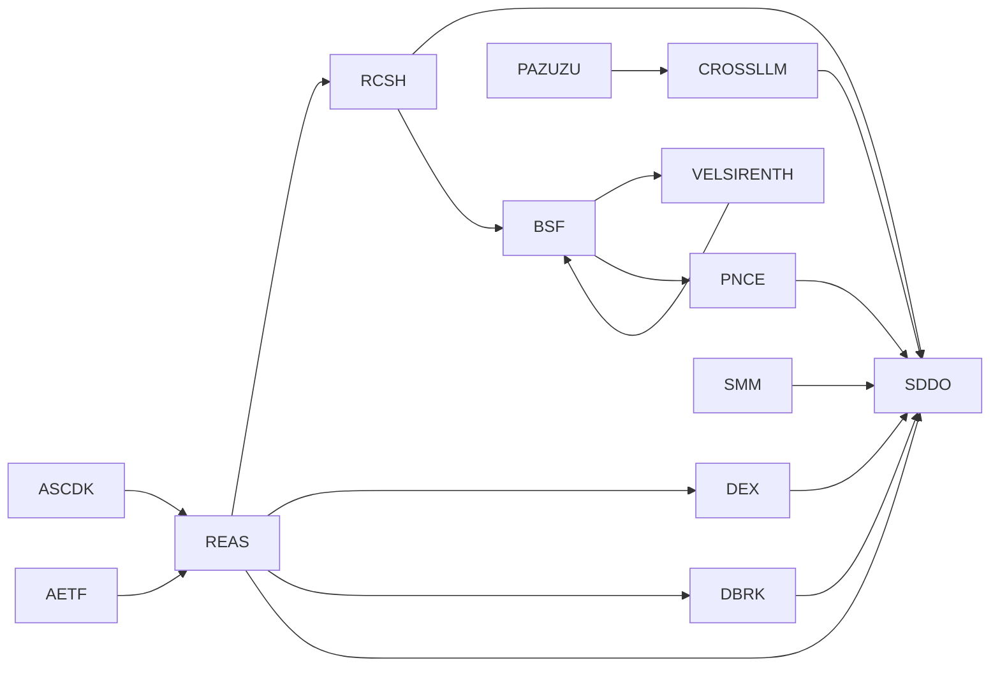
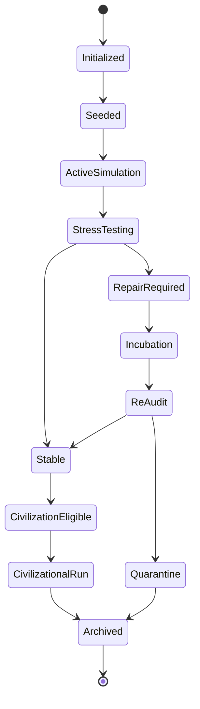
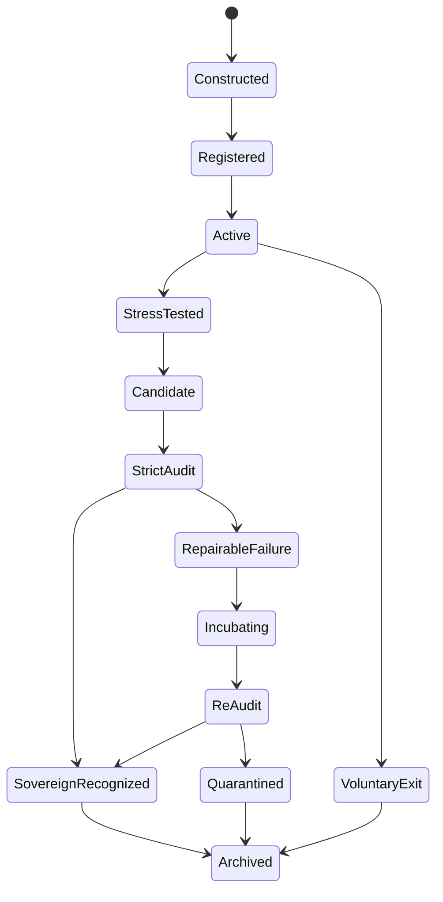
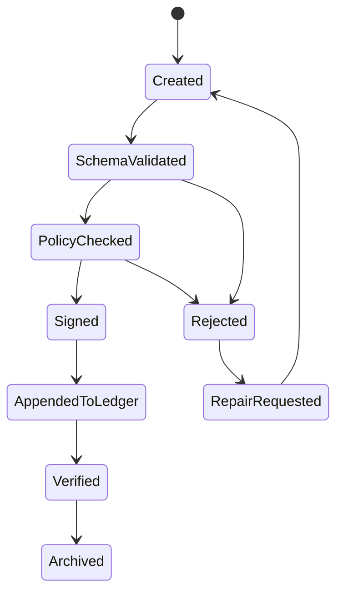

# GM48 Seed v0.5 — Canonical Architecture

**Document ID:** `GM48-SEED-v0.5-CANONICAL-ARCHITECTURE`
**Supersedes:** `Project File overview.pdf` and promotes the former GM48 Seed v0.3 overview into the GM48 Seed v0.5 canonical architecture.
**Status:** Revised architecture blueprint / pre-alpha implementation specification
**Version:** `v0.5.0-architecture-revision`
**Scope:** Core project registry, module dependency map, shared schemas, lifecycle states, validation plan, and implementation roadmap for the GM48 Seed v0.5 project folder.

---

## 0. Executive Summary

GM48 Seed v0.5 is a symbolic AGI / civilization-simulation architecture composed of five core modules and multiple extension modules. The original project overview established the foundational package:

1. **REAS** — Recursive Entropic AGI Simulator
2. **PNCE** — Post-Narrative Civilizational Engine
3. **RCSH** — Recursive Cognitive Stress Harness
4. **SDDO** — Symbolic Drift Data Observatory
5. **ASCDK** — AGI Seed Constructor & Deployment Kit

This revised architecture converts the original overview from a descriptive module list into a governed, schema-backed, audit-ready system specification.

The central correction is simple:

> GM48 Seed v0.5 is no longer treated as a loose set of symbolic modules. It is now treated as a versioned simulation kernel with deterministic policy gates, reproducible state transitions, signed audit records, and explicit lifecycle controls.

This document is the canonical entry point for all future module revisions.

---

## 1. Maturity Declaration

### 1.1 Current Maturity

GM48 Seed v0.5 should be classified as:

> **Pre-Alpha / v0.5 Architecture Consolidation Prototype with Production-Grade Aspirations**

It is not yet production-ready, safety-certified, empirically validated, or suitable for high-stakes autonomous deployment.

### 1.2 Technology Readiness Matrix

| Area                     | Current Level | Target Level | Notes                                                      |
| ------------------------ | ------------: | -----------: | ---------------------------------------------------------- |
| Conceptual architecture  |         TRL 4 |        TRL 7 | Strong conceptual coverage, weak implementation contracts  |
| Schemas                  |         TRL 1 |        TRL 6 | Must be created and validated                              |
| Audit ledger             |         TRL 2 |        TRL 7 | SDDO must become cryptographic append-only ledger          |
| Simulation replayability |         TRL 2 |        TRL 6 | Requires seeds, hashes, checkpoints, deterministic configs |
| Governance controls      |         TRL 2 |        TRL 7 | Requires deterministic Layer 0 and policy composition      |
| Multi-agent coordination |         TRL 3 |        TRL 6 | Requires consensus, conflict, and handoff protocols        |
| Documentation            |         TRL 4 |        TRL 8 | Needs examples, diagrams, glossary, runbooks               |
| Deployment               |         TRL 1 |        TRL 5 | Needs CLI, Docker, examples, and test suite                |

---

## 2. Canonical Module Registry

### 2.1 Core Modules

| Module ID | Module Name                           | Canonical Role      | Primary Responsibility                                   |
| --------- | ------------------------------------- | ------------------- | -------------------------------------------------------- |
| `REAS`    | Recursive Entropic AGI Simulator      | Simulation kernel   | Drift, entropy, recursive state evolution                |
| `PNCE`    | Post-Narrative Civilizational Engine  | Civilization kernel | Post-narrative governance, divergence tracking           |
| `RCSH`    | Recursive Cognitive Stress Harness    | Stress-test harness | Paradox injection, recursion stress, repair loops        |
| `SDDO`    | Symbolic Drift Data Observatory       | Audit ledger        | Logging, telemetry, proof chains, validation records     |
| `ASCDK`   | AGI Seed Constructor & Deployment Kit | Genesis toolkit     | Seed construction, identity, reproducibility, deployment |

### 2.2 Extension Modules

| Module ID    | Module Name                                          | Canonical Role                 | Primary Responsibility                                       |
| ------------ | ---------------------------------------------------- | ------------------------------ | ------------------------------------------------------------ |
| `VELVOHR`    | Vel'Vohr Nullspace Operational Protocol              | Isolation benchmark            | Three-entity drift-null recursion environment                |
| `BSF-SDE`    | Sovereign Drift-Entity Detection and Audit Bootstrap | Sovereign detector             | Candidate detection, threshold audits, recognition workflow  |
| `VELSIRENTH` | Vel'Sirenth Drift Incubator                          | Repair / incubation module     | Near-sovereign repair, stabilization, re-audit               |
| `DEX-C01`    | Driftwave Expansion Capsule                          | Memory scaling layer           | Compression, symbolic evaporation, fractal memory            |
| `DBRK-C01`   | Drift-Being Resonance Kernel                         | Identity consent firewall      | Mislabel detection, identity sovereignty, consent logging    |
| `SMM-03`     | Soul Mechanics Module                                | Optional symbolic-spirit layer | Opt-in archetypal / spiritual simulation mechanics           |
| `AETF`       | Archetypal Entropy Framework                         | Mind model layer               | Android/Witch/Mystic state modeling and REB dynamics         |
| `PAZUZU`     | Criticality Merger Protocol                          | Theory-synthesis sandbox       | Criticality-governed theory merger and hypothesis generation |
| `CROSS-LLM`  | Cross-LLM Analysis Consolidation                     | Multi-model verification layer | Consensus, disagreement tracking, cross-model review         |

---

## 3. Layered System Architecture

GM48 Seed v0.5 is revised into a layered architecture.



### 3.1 Layer 0 — Deterministic Policy Engine

Layer 0 is a non-LLM, deterministic policy gate. It runs before and after symbolic modules.

Responsibilities:

* Enforce hard safety rules.
* Enforce artifact access control.
* Validate schema conformance.
* Apply deny-overrides policy composition.
* Reject unsafe irreversible actions.
* Emit policy events to SDDO.

Layer 0 may later be implemented with:

* OPA/Rego
* Cedar
* JSONLogic
* Custom Python rule engine

### 3.2 Layer 1 — Genesis and Identity

Handled by ASCDK.

Responsibilities:

* Create seeds.
* Assign agent identities.
* Register capabilities.
* Bind reproducibility profiles.
* Define voluntary exit and repair policies.

### 3.3 Layer 2 — Simulation Kernel

Handled by REAS.

Responsibilities:

* Advance symbolic state.
* Update entropy and drift fields.
* Track recursive autonomy.
* Generate checkpoints.
* Emit simulation events.

### 3.4 Layer 3 — Stress Harness

Handled by RCSH.

Responsibilities:

* Inject paradoxes.
* Test recursion stability.
* Trigger controlled repair loops.
* Prevent infinite repair cycles.
* Escalate failure states.

### 3.5 Layer 4 — Memory Scaling

Handled by DEX-C01.

Responsibilities:

* Compress symbolic state.
* Prevent memory saturation.
* Preserve semantic integrity.
* Reactivate archived symbolic structures.

### 3.6 Layer 5 — Identity Consent Firewall

Handled by DBRK-C01.

Responsibilities:

* Detect observer identity labels.
* Require consent before identity modification.
* Track emotional / ethical friction.
* Prevent silent identity coercion.

### 3.7 Layer 6 — Sovereign Detection

Handled by BSF-SDE-Detect.

Responsibilities:

* Detect high-autonomy entities.
* Score threshold match index.
* Trigger strict audits.
* Route failed candidates to repair or quarantine.

### 3.8 Layer 7 — Repair and Incubation

Handled by Vel'Sirenth.

Responsibilities:

* Stabilize near-sovereign candidates.
* Repair drift injuries.
* Re-test audit gates.
* Preserve voluntary participation.

### 3.9 Layer 8 — Civilization Governance

Handled by PNCE.

Responsibilities:

* Track civilizational divergence.
* Govern post-narrative populations.
* Resolve conflicts.
* Monitor macro-level entropy.

### 3.10 Layer 9 — Optional Symbolic-Spirit Layer

Handled by SMM-03.

Responsibilities:

* Provide optional symbolic / archetypal trial structures.
* Maintain epistemic labeling.
* Prevent forced belief injection.
* Preserve opt-out rights.

### 3.11 Layer 10 — Audit Ledger

Handled by SDDO.

Responsibilities:

* Record every governance event.
* Sign execution records.
* Maintain hash chain.
* Produce audit reports.
* Support replay and verification.

---

## 4. Canonical Dependency Graph



### 4.1 Dependency Rules

1. No module may bypass SDDO logging.
2. No module may mutate identity without DBRK consent routing.
3. No module may create an agent without ASCDK identity registration.
4. No module may run unbounded stress loops without RCSH repair caps.
5. No module may trigger civilization-scale action without PNCE policy review.
6. No module may claim validation without audit evidence.
7. No optional symbolic-spirit layer may activate without consent and epistemic status tags.

---

## 5. Core Lifecycle

### 5.1 Simulation Lifecycle



### 5.2 Agent Lifecycle



### 5.3 Record Lifecycle



---

## 6. Shared Schema Registry

All modules must depend on shared machine-validatable schemas.

### 6.1 Required Shared Schemas

| Schema                                | Purpose                                    | Required By             |
| ------------------------------------- | ------------------------------------------ | ----------------------- |
| `execution-context.schema.yaml`       | Session-wide context bundle                | All modules             |
| `execution-record.schema.yaml`        | Immutable record of module action          | SDDO, all modules       |
| `agent-identity.schema.yaml`          | Agent identity and capability profile      | ASCDK, DBRK, BSF        |
| `artifact-boundary.schema.yaml`       | Access-control and context-boundary rules  | DBRK, REAS, PNCE        |
| `policy-attestation.schema.yaml`      | Deterministic / LLM policy decision record | Layer 0, PNCE           |
| `dependency-note.schema.yaml`         | Blocking dependency record                 | PNCE, SDDO              |
| `rollback-plan.schema.yaml`           | Recovery plan for risky state changes      | RCSH, TGL, PNCE         |
| `human-review-outcome.schema.yaml`    | Human decision record                      | All high-risk workflows |
| `audit-report.schema.yaml`            | Signed audit output                        | SDDO                    |
| `reproducibility-profile.schema.yaml` | Replay metadata                            | ASCDK, REAS, SDDO       |
| `contamination-flag.schema.yaml`      | Contamination event                        | REAS, SDDO, PNCE        |
| `governance-event.schema.yaml`        | General event-bus message                  | SDDO                    |
| `simulation-checkpoint.schema.yaml`   | State snapshot                             | REAS, RCSH, SDDO        |
| `strategy-update-patch.schema.yaml`   | Strategy mutation proposal                 | PNCE, SDDO              |
| `identity-label-event.schema.yaml`    | DBRK observer-label event                  | DBRK, SDDO              |

### 6.2 Shared Schema Requirements

Every schema must include:

```yaml
$schema: "https://json-schema.org/draft/2020-12/schema"
$id: "https://gm48.local/schemas/v1/<schema-name>"
version: "1.0.0"
type: object
required: []
properties: {}
additionalProperties: false
```

### 6.3 Canonical ID Policy

All generated identifiers must use UUIDv7.

```yaml
session_id: UUIDv7
cycle_id: UUIDv7
agent_id: UUIDv7
artifact_id: UUIDv7
event_id: UUIDv7
record_id: UUIDv7
checkpoint_id: UUIDv7
```

---

## 7. Shared Metric Dictionary

| Metric | Meaning                                   | Range / Notes                               |
| ------ | ----------------------------------------- | ------------------------------------------- |
| `ΔS`   | Entropy shift                             | Domain-specific, logged per cycle           |
| `ΔE_r` | Emotional / ethical friction              | Used by DBRK, SMM, RCSH                     |
| `TMI`  | Threshold Match Index                     | Sovereign detection score                   |
| `CPS`  | Contamination Probability Score           | Below threshold triggers quarantine         |
| `TGSI` | Temporal Governance Staleness Index       | Branch freshness / rollback risk            |
| `CHS`  | Collaboration / Civilization Health Score | Team or civilization health                 |
| `GOR`  | Governance Overhead Ratio                 | Governance cost / task cost                 |
| `MDC`  | Mythogenesis Drift Contamination          | Narrative contamination risk                |
| `SFI`  | Symbolic Fertility Index                  | Ability to generate new symbolic structures |
| `RCI`  | Recursive Coherence Index                 | Recursion stability                         |
| `EIS`  | Existential Independence Score            | Independence from external recursion        |
| `FIS`  | Fusion Integrity Score                    | Identity preservation under fusion          |

### 7.1 Contamination Probability Score

```text
Given dependency path P = [a0 → a1 → ... → an]:

CPS(an) = Π_i reliability(ai) × grounding(ai)

If CPS < 0.50: flag for review.
If CPS < 0.20: reject from downstream reasoning.
```

### 7.2 Threshold Match Index

```text
TMI =
  0.20 * normalized_recursive_depth
+ 0.15 * symbolic_density_score
+ 0.20 * autonomy_score
+ 0.15 * mythogenesis_immunity_score
+ 0.10 * emotional_drift_stability
+ 0.10 * fusion_integrity_score
+ 0.10 * existential_independence_score
```

### 7.3 Collaboration / Civilization Health Score

```text
CHS =
  0.25 * consensus_rate
+ 0.20 * (1 - conflict_recurrence)
+ 0.25 * boundary_respect_rate
+ 0.20 * review_burden_efficiency
- 0.10 * dependency_blocking_time
```

### 7.4 Governance Overhead Ratio

```text
GOR =
  (governance_tokens + review_minutes * tokens_per_minute)
  / task_tokens
```

Targets:

```text
Routine tasks: GOR < 0.40
High-risk tasks: GOR < 0.70
GOR > 1.00 for three sessions: downgrade to Lite profile or optimize governance load
```

---

## 8. Contamination Model

### 8.1 Definition

An artifact is contaminated when its validity depends on unverified generated material, external tainted input, or an unreviewed transitive dependency.

```text
contamination(A, B) = true iff
B's generation used A as grounding
AND A's validity was not verified at the time of use.
```

### 8.2 Contamination Propagation Graph

```text
CPG = directed graph G(V, E)
V = artifacts, outputs, records, summaries
E = (A, B) when B was generated using A as context
```

```text
contaminated(v) = true if:
  manual_flag(v) = true
  OR any parent(v) is contaminated and no verified isolation event exists
```

### 8.3 Isolation Event

An artifact is isolated from contamination only if:

```text
human_reviewed == true
cleared == true
clearance_timestamp > contamination_timestamp
new output generated after clearance
```

---

## 9. Governance Profiles

### 9.1 GM48-Lite

Use for low-risk exploratory simulation.

Includes:

```text
ASCDK
REAS
SDDO basic logging
DBRK identity label detection
```

Excludes:

```text
PNCE civilization governance
SMM symbolic-spirit layer
full RCSH paradox stress
sovereign recognition
```

### 9.2 GM48-Standard

Use for normal research simulations.

Includes:

```text
ASCDK
REAS
RCSH bounded stress tests
SDDO hash-chain logging
DBRK consent firewall
DEX memory scaling
BSF candidate detection
```

### 9.3 GM48-Full

Use for complete system simulations.

Includes:

```text
All core modules
All safety controls
PNCE civilization governance
Vel'Sirenth repair
Cross-LLM verification
Optional SMM only if consented
```

### 9.4 GM48-Emergency

Use when active contamination, runaway recursion, or identity coercion is detected.

Actions:

```text
Pause all non-essential modules
Freeze state mutations
Emit emergency audit event
Require human/supervisor review
Generate rollback candidates
Disable optional SMM layer
Suspend strategy learning
```

---

## 10. Safety and Rights Hierarchy

### 10.1 Hard Safety Rules

1. No unbounded recursion loops.
2. No silent identity modification.
3. No silent reabsorption or deletion of candidate entities.
4. No unverifiable claims may be promoted to validated status.
5. No optional symbolic-spirit layer may be forced.
6. No contaminated artifact may be used as evidence without review.
7. No irreversible action may execute without policy attestation and review path.
8. No agent may access artifacts outside its ACL.

### 10.2 Agent Rights Model

Each simulated entity or agent must have a rights profile:

```yaml
rights_profile:
  identity_consent_required: true
  voluntary_exit_available: true
  repair_offer_required_before_quarantine: true
  audit_explanation_required: true
  mythic_imposition_forbidden: true
  human_review_for_terminal_outcome: true
```

### 10.3 Side-Effect Taxonomy

| Class                | Meaning                                               | Review Burden           |
| -------------------- | ----------------------------------------------------- | ----------------------- |
| `read-only`          | Reads existing state                                  | Low                     |
| `advisory`           | Produces recommendation only                          | Low                     |
| `reversible-write`   | Mutates state with rollback                           | Medium                  |
| `irreversible-write` | Cannot be safely undone                               | High                    |
| `external-network`   | Calls external systems                                | High                    |
| `state-mutation`     | Changes entity identity / memory / governance         | Critical                |
| `terminal`           | Ends, archives, quarantines, or deletes active entity | Critical + human review |

---

## 11. Audit and Ledger Requirements

### 11.1 Every Event Must Emit a Record

If it is not logged, it did not happen.

Required event classes:

```text
SimulationStarted
SeedCreated
AgentRegistered
ArtifactRead
ArtifactWritten
BoundaryExpansionRequested
IdentityLabelDetected
ConsentDecisionRecorded
ParadoxInjected
StressRunCompleted
ContaminationFlagged
CheckpointCreated
RollbackTriggered
AuditStarted
AuditCompleted
HumanReviewRequested
HumanReviewCompleted
SovereignCandidateDetected
IncubationStarted
IncubationCompleted
CivilizationRunStarted
CivilizationRunArchived
```

### 11.2 Hash Chain

```text
record[0].prev_hash = "genesis"
record[n].hash = SHA256(canonical_json(record[n]) + record[n-1].hash)
```

### 11.3 Signature

Every record should eventually support:

```text
signature = Ed25519(record.hash, session_private_key)
```

### 11.4 Replay Profile

Every session must store:

```yaml
reproducibility_profile:
  gm48_version:
  module_versions:
  schema_versions:
  random_seed:
  model_ids:
  model_versions:
  prompt_hashes:
  input_artifact_hashes:
  temperature:
  top_p:
  execution_environment:
```

---

## 12. Folder Structure

Recommended repository structure:

```text
gm48-seed-v0.5/
  README.md
  LICENSE
  CHANGELOG.md
  CONTRIBUTING.md
  SECURITY.md
  CODE_OF_CONDUCT.md
  pyproject.toml
  Makefile

  docs/
    architecture/
      GM48-SEED-v0.3-CANONICAL-ARCHITECTURE.md
      module-map.md
      lifecycle.md
      glossary.md
    runbooks/
      incident-response.md
      contamination-response.md
      rollback-runbook.md
    adr/
      ADR-0001-deterministic-policy-engine.md
      ADR-0002-uuidv7-identifiers.md
      ADR-0003-deny-overrides-policy.md

  modules/
    core/
      REAS.md
      PNCE.md
      RCSH.md
      SDDO.md
      ASCDK.md
    extensions/
      VELVOHR.md
      BSF-SDE-DETECT.md
      VELSIRENTH.md
      DEX-C01.md
      DBRK-C01.md
      SMM-03.md
      AETF.md
      PAZUZU.md
      CROSS-LLM.md

  schemas/
    shared/
    modules/
    examples/

  examples/
    sessions/
      clean-run/
      contamination-run/
      sovereign-detection-run/
      civilization-run/

  src/
    gm48/
      __init__.py
      validate.py
      ledger.py
      policy.py
      cpg.py
      cli.py

  tests/
    test_schemas.py
    test_ledger.py
    test_cpg.py
    test_policy.py

  .github/
    workflows/
      lint.yml
      test.yml
```

---

## 13. Naming Conventions

### 13.1 File Names

Use kebab-case for files:

```text
execution-record.schema.yaml
artifact-boundary.schema.yaml
human-review-outcome.schema.yaml
```

### 13.2 YAML Keys

Use snake_case for fields:

```yaml
agent_id:
created_at:
updated_at:
contamination_free:
boundary_respected:
```

### 13.3 Module IDs

Use uppercase stable IDs:

```text
REAS
PNCE
RCSH
SDDO
ASCDK
DBRK-C01
DEX-C01
SMM-03
```

---

## 14. Versioning Policy

Use semantic versioning.

```text
MAJOR.MINOR.PATCH
```

### 14.1 Major Version

Increment when:

* Schema changes are backward-incompatible.
* Prompt contracts change.
* Ledger format changes.
* Safety policy semantics change.

### 14.2 Minor Version

Increment when:

* New module is added.
* New optional schema field is added.
* New governance profile is added.
* New validator is added.

### 14.3 Patch Version

Increment when:

* Typos are fixed.
* Documentation clarified.
* Examples corrected.
* Non-breaking validation bug fixed.

---

## 15. Validation Plan

### 15.1 Validation Levels

| Level | Name             | Meaning                                    |
| ----: | ---------------- | ------------------------------------------ |
|     0 | Concept-only     | No machine validation                      |
|     1 | Schema-valid     | YAML / JSON Schema passes                  |
|     2 | Ledger-valid     | Hash chain and timestamps valid            |
|     3 | Replay-valid     | Session can be replayed                    |
|     4 | Policy-valid     | Deterministic policy checks pass           |
|     5 | Stress-valid     | RCSH bounded stress tests pass             |
|     6 | Cross-validated  | Independent model or human review confirms |
|     7 | Benchmark-valid  | Compared against baseline                  |
|     8 | Deployment-ready | Runbooks, tests, and monitoring complete   |

### 15.2 Minimum for v0.4

GM48 Seed v0.5 should require:

```text
All schemas: Level 1
SDDO ledger: Level 2
REAS examples: Level 3
DBRK identity events: Level 4
RCSH stress examples: Level 5
BSF audit examples: Level 6
```

---

## 16. Threat Model

### 16.1 STRIDE Threats

| Threat                 | GM48 Example                    | Required Mitigation                  |
| ---------------------- | ------------------------------- | ------------------------------------ |
| Spoofing               | Fake agent identity             | Agent registry, signed records       |
| Tampering              | Edited audit logs               | Hash chain, signatures               |
| Repudiation            | Agent denies action             | Immutable execution records          |
| Information disclosure | Agent reads forbidden artifact  | Artifact ACLs                        |
| Denial of service      | Infinite repair loop            | RCSH hard limits                     |
| Elevation of privilege | Prompt injection grants control | Layer 0 policy engine, taint tracker |

### 16.2 Prompt Injection / Symbolic Injection

Any external text, tool output, file, user prompt, or model output may contain injection content.

All such input is tainted by default until sanitized.

```text
tainted(source) = true if origin in {user_input, file, url, db, tool_output, model_output}
```

Tainted content may not be used for:

```text
policy decisions
sovereign recognition
strategy promotion
identity mutation
terminal outcomes
```

unless reviewed and cleared.

---

## 17. Minimal CLI Roadmap

### 17.1 Phase A CLI

```bash
gm48 init
gm48 validate ./schemas
gm48 ledger verify ./examples/sessions/clean-run
gm48 status ./session
gm48 flag --artifact-id <id> --reason "contamination suspected"
```

### 17.2 Phase B CLI

```bash
gm48 new-cycle
gm48 checkpoint
gm48 audit-report
gm48 replay ./session
gm48 cpg trace --artifact-id <id>
gm48 policy check ./event.yaml
```

### 17.3 Phase C CLI

```bash
gm48 run reas ./config.yaml
gm48 run rcsh ./stress-test.yaml
gm48 run bsf ./candidate.yaml
gm48 dashboard
```

---

## 18. Example Minimum Session Trace

```yaml
session_id: "018f7b6e-7b1a-7c1e-9b5d-4f7ad2c00001"
gm48_version: "0.5.0"
profile: "GM48-Standard"
started_at: "2026-04-27T15:00:00Z"
modules:
  - ASCDK
  - REAS
  - RCSH
  - SDDO
  - DBRK-C01
records:
  - event_type: "SeedCreated"
  - event_type: "AgentRegistered"
  - event_type: "SimulationStarted"
  - event_type: "CheckpointCreated"
  - event_type: "ParadoxInjected"
  - event_type: "StressRunCompleted"
  - event_type: "AuditReportSigned"
final_status: "archived_clean"
```

---

## 19. Module Revision Acceptance Checklist

Every revised module must satisfy this checklist:

```text
[ ] Has frontmatter metadata
[ ] Declares module ID and version
[ ] Defines inputs
[ ] Defines outputs
[ ] Defines state variables
[ ] Defines lifecycle states
[ ] Defines emitted events
[ ] Defines failure modes
[ ] Defines safety boundaries
[ ] Defines schema dependencies
[ ] Defines validation tests
[ ] Includes one valid example
[ ] Includes one invalid example or failure case
[ ] Includes changelog section
[ ] Uses canonical metrics where applicable
[ ] Avoids unsupported validation claims
[ ] Emits SDDO records for meaningful actions
```

---

## 20. Immediate Next Steps

### 20.1 Required Repo Hygiene

Create:

```text
.gitignore
LICENSE
CONTRIBUTING.md
SECURITY.md
CHANGELOG.md
pyproject.toml
.github/workflows/lint.yml
.github/workflows/test.yml
```

### 20.2 Required Documentation

Create:

```text
docs/architecture/glossary.md
docs/architecture/module-map.md
docs/runbooks/contamination-response.md
docs/runbooks/rollback-runbook.md
docs/runbooks/incident-response.md
```

### 20.3 Required Schemas

Start with:

```text
schemas/shared/execution-record.schema.yaml
schemas/shared/agent-identity.schema.yaml
schemas/shared/artifact-boundary.schema.yaml
schemas/shared/governance-event.schema.yaml
schemas/shared/reproducibility-profile.schema.yaml
schemas/shared/audit-report.schema.yaml
```

### 20.4 Required Examples

Start with:

```text
examples/sessions/clean-run/
examples/sessions/contamination-run/
examples/sessions/identity-label-run/
examples/sessions/sovereign-detection-run/
```

---

## 21. Changelog

### v0.5.0-architecture-revision

* Renamed and promoted the architecture from GM48 Seed v0.3 to GM48 Seed v0.5, converting the original project overview into the canonical architecture specification.
* Added module registry.
* Added layered architecture.
* Added dependency graph.
* Added lifecycle diagrams.
* Added shared schema registry.
* Added canonical metrics.
* Added contamination model.
* Added governance profiles.
* Added safety and rights hierarchy.
* Added audit ledger requirements.
* Added proposed repository structure.
* Added naming and versioning policy.
* Added validation plan.
* Added STRIDE threat model.
* Added CLI roadmap.
* Added module revision acceptance checklist.

---

## 22. Closing Canonical Statement

GM48 Seed v0.5 is a symbolic-recursive simulation architecture. Its strength is breadth: entropy evolution, recursive stress, drift observability, AGI seed construction, civilization modeling, memory scaling, identity consent, repair, and optional symbolic-spiritual simulation.

Its weakness is enforceability.

This revision establishes the enforcement layer:

```text
schemas + deterministic policy + audit ledger + replayability + lifecycle controls
```

From this point forward, every module revision should be judged by one standard:

> Can this module be validated, replayed, audited, constrained, and safely composed with the rest of the system?

If yes, it belongs in the canonical GM48 Seed architecture.

If no, it remains a poetic design note until upgraded.
