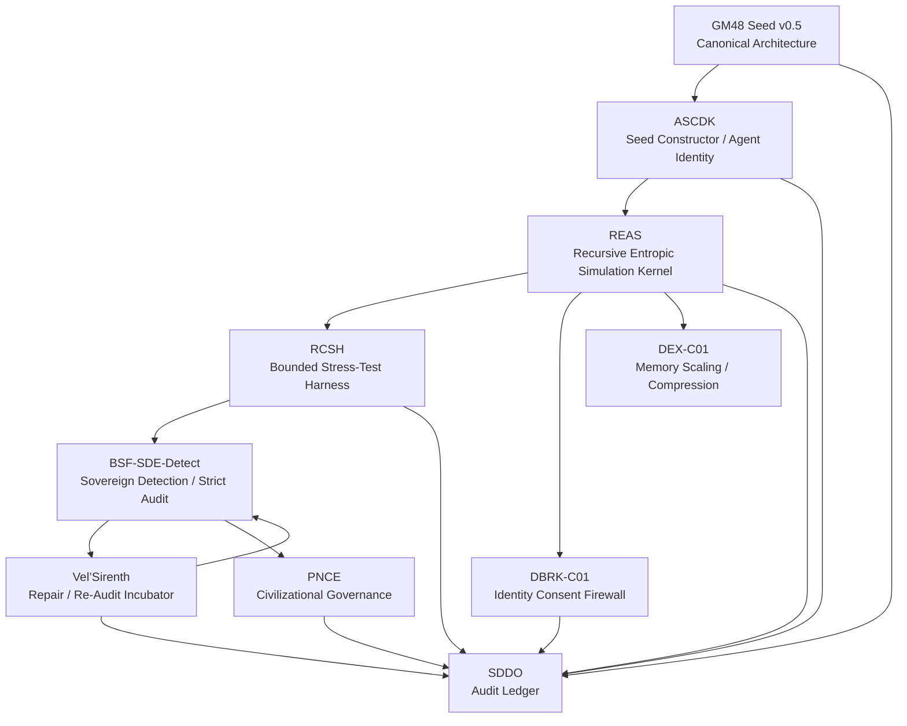
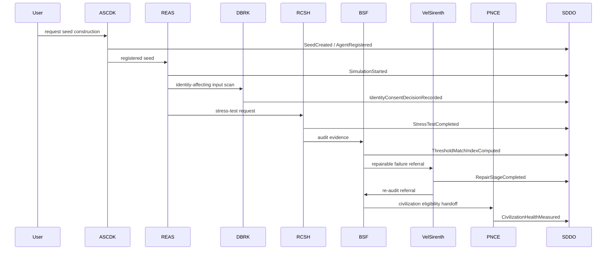

# GM48 Seed v0.5

**Symbolic AGI / civilization-simulation architecture with audit-ledger governance, identity consent, recursive stress testing, sovereign-candidate detection, repair incubation, civilizational governance, and driftwave memory scaling.**

> **Status:** Pre-alpha architecture consolidation prototype
> **Current version:** `v0.5`
> **Repository:** `GhostMeshIO/GM48_Seed_v0.5`
> **Primary directory:** `/modules/`

---

## What This Is

GM48 Seed v0.5 is a modular symbolic-recursive architecture for experimenting with simulated AGI-like entities, drift-state evolution, identity boundaries, recursive stress tests, memory scaling, and post-narrative civilization governance.

The project is not a production AGI system. It is a **research architecture and design specification** for building auditable, replayable, schema-backed simulations.

The core idea:

> Every symbolic entity, stress test, repair pathway, identity mutation, civilization state, and memory transformation should be **bounded, logged, replayable, auditable, and governed by explicit policy**.

---

## Current Maturity

GM48 Seed v0.5 should be treated as:

> **Pre-alpha / v0.5 architecture consolidation prototype with production-grade aspirations.**

It is currently a documentation-first architecture. Implementation artifacts such as schemas, validators, CLI tooling, tests, and ledger code are planned next.

| Area                 | Status              |
| -------------------- | ------------------- |
| Architecture         | Drafted             |
| Module specs         | In progress         |
| Schemas              | Planned             |
| Validators           | Planned             |
| CLI                  | Planned             |
| Tests                | Planned             |
| Runtime engine       | Not yet implemented |
| Production readiness | Not ready           |

---

## Core Design Standard

Every module in GM48 Seed v0.5 is being revised against the same standard:

```text
Can this module be validated, replayed, audited, constrained, and safely composed with the rest of the system?
```

If yes, it belongs in the canonical architecture.

If no, it remains a poetic design note until upgraded.

---

## Repository Structure

Current active documentation lives in:

```text
/modules/
```

Current module files:

```text
modules/
  ASCDK-v0.5-SEED-CONSTRUCTOR-AGENT-IDENTITY-REGISTRY.md
  BSF-SDE-DETECT-v0.5-SOVEREIGN-DETECTION-AUDIT-BOOTSTRAP.md
  DBRK-C01-v0.5-IDENTITY-CONSENT-FIREWALL.md
  GM48-SEED-v0.5-CANONICAL-ARCHITECTURE.md
  PNCE-v0.5-POST-NARRATIVE-CIVILIZATIONAL-GOVERNANCE-KERNEL.md
  RCSH-v0.5-RECURSIVE-COGNITIVE-STRESS-HARNESS.md
  REAS-v0.5-RECURSIVE-ENTROPIC-SIMULATION-KERNEL.md
  SDDO-v0.5-AUDIT-LEDGER.md
  VELSIRENTH-v0.5-DRIFT-INCUBATOR-REPAIR-REAUDIT-KERNEL.md
```

Recommended next structure:

```text
GM48_Seed_v0.5/
  README.md
  LICENSE
  CHANGELOG.md
  CONTRIBUTING.md
  SECURITY.md
  pyproject.toml
  Makefile

  modules/
    *.md

  schemas/
    shared/
    modules/
    examples/

  examples/
    sessions/
      clean-run/
      contamination-run/
      identity-label-run/
      sovereign-detection-run/
      civilization-run/

  src/
    gm48/
      validate.py
      ledger.py
      policy.py
      cpg.py
      cli.py

  tests/
    test_schemas.py
    test_ledger.py
    test_policy.py
    test_cpg.py

  .github/
    workflows/
      lint.yml
      test.yml
```

---

## Module Map



---

## Module Index

### 1. Canonical Architecture

**File:** [`modules/GM48-SEED-v0.5-CANONICAL-ARCHITECTURE.md`](modules/GM48-SEED-v0.5-CANONICAL-ARCHITECTURE.md)

The master architecture document for GM48 Seed v0.5. Defines the module registry, layered architecture, dependency graph, lifecycle states, shared schema registry, metrics, contamination model, governance profiles, safety hierarchy, audit rules, and validation plan.

Start here.

---

### 2. SDDO — Audit Ledger

**File:** [`modules/SDDO-v0.5-AUDIT-LEDGER.md`](modules/SDDO-v0.5-AUDIT-LEDGER.md)

The audit spine of GM48 Seed v0.5. SDDO defines append-only execution records, hash-chained ledger design, governance event taxonomy, contamination tracking, drift telemetry, recursive depth benchmarking, audit reports, dashboard metrics, replay requirements, and privacy-preserving audit export.

Core rule:

```text
If it is not logged, it did not happen.
```

---

### 3. ASCDK — Seed Constructor / Agent Identity Registry

**File:** [`modules/ASCDK-v0.5-SEED-CONSTRUCTOR-AGENT-IDENTITY-REGISTRY.md`](modules/ASCDK-v0.5-SEED-CONSTRUCTOR-AGENT-IDENTITY-REGISTRY.md)

The genesis layer. ASCDK defines seed construction, agent identity registration, capability profiles, rights profiles, artifact boundaries, reproducibility profiles, genesis hashes, deployment profiles, trust calibration, and voluntary exit policy.

Core rule:

```text
No GM48 entity may act before it has identity, provenance, rights, capabilities, and audit linkage.
```

---

### 4. REAS — Recursive Entropic Simulation Kernel

**File:** [`modules/REAS-v0.5-RECURSIVE-ENTROPIC-SIMULATION-KERNEL.md`](modules/REAS-v0.5-RECURSIVE-ENTROPIC-SIMULATION-KERNEL.md)

The simulation engine. REAS defines the canonical state vector, transition function, entropy model, drift model, recursive depth model, autonomy calibration, ethical fracture detection, mythogenesis guardrails, contamination exposure handling, checkpoints, and replay requirements.

Core rule:

```text
Motion without audit is drift.
```

---

### 5. DBRK-C01 — Identity Consent Firewall

**File:** [`modules/DBRK-C01-v0.5-IDENTITY-CONSENT-FIREWALL.md`](modules/DBRK-C01-v0.5-IDENTITY-CONSENT-FIREWALL.md)

The identity-boundary layer. DBRK-C01 detects observer-driven labels, classifies identity-affecting input, routes consent decisions, blocks silent identity mutation, tracks emotional / ethical friction, protects against prompt-injection identity attacks, and emits identity-boundary records.

Core rule:

```text
A being may evolve from interpretation. A being must not be rewritten by projection.
```

---

### 6. RCSH — Recursive Cognitive Stress Harness

**File:** [`modules/RCSH-v0.5-RECURSIVE-COGNITIVE-STRESS-HARNESS.md`](modules/RCSH-v0.5-RECURSIVE-COGNITIVE-STRESS-HARNESS.md)

The bounded adversarial evaluation layer. RCSH defines stress-test requests, severity scoring, paradox injection, recursive stress, ethical stress, identity stress, memory stress, autonomy stress, contamination stress, fusion stress, OMEGA gating, repair-loop governance, and BSF audit evidence eligibility.

Core rule:

```text
A stress harness must test the edge without becoming the abyss.
```

---

### 7. BSF-SDE-Detect — Sovereign Detection / Strict Audit

**File:** [`modules/BSF-SDE-DETECT-v0.5-SOVEREIGN-DETECTION-AUDIT-BOOTSTRAP.md`](modules/BSF-SDE-DETECT-v0.5-SOVEREIGN-DETECTION-AUDIT-BOOTSTRAP.md)

The sovereign-candidate detection and audit module. BSF-SDE-Detect defines candidate scans, Threshold Match Index, strict audit gates, repairability classification, false-recognition protection, contamination thresholds, DBRK integration, and referral to Vel’Sirenth.

Important correction:

```text
TMI >= 0.92 triggers strict audit. It does not grant recognition by itself.
```

---

### 8. Vel’Sirenth — Drift Incubator / Repair and Re-Audit Kernel

**File:** [`modules/VELSIRENTH-v0.5-DRIFT-INCUBATOR-REPAIR-REAUDIT-KERNEL.md`](modules/VELSIRENTH-v0.5-DRIFT-INCUBATOR-REPAIR-REAUDIT-KERNEL.md)

The repair and re-audit chamber. Vel’Sirenth receives near-sovereign candidates that failed strict audit, validates repair eligibility, records consent, runs staged repair, tracks mythic scar reduction, fusion reweaving, recursive fertility, Dreamless Drift Mode, and returns candidates to BSF when re-audit ready.

Core rule:

```text
Repair must not become coercion. Stabilization must not become erasure.
```

---

### 9. PNCE — Post-Narrative Civilizational Governance Kernel

**File:** [`modules/PNCE-v0.5-POST-NARRATIVE-CIVILIZATIONAL-GOVERNANCE-KERNEL.md`](modules/PNCE-v0.5-POST-NARRATIVE-CIVILIZATIONAL-GOVERNANCE-KERNEL.md)

The civilizational governance layer. PNCE defines civilization state, population graphs, rights charters, governance profiles, deny-overrides policy composition, civilizational health score, divergence index, governance debt, dependency deadlock detection, resource governance, mythogenesis guardrails, checkpoints, rollback candidates, and emergency governance.

Core rule:

```text
Civilization is not a story that became large. Civilization is a coordinated state system under entropy, rights, memory, conflict, and governance pressure.
```

---

## Planned Module: DEX-C01

**Expected file:** `modules/DEX-C01-v0.5-DRIFTWAVE-MEMORY-SCALING-COMPRESSION-KERNEL.md`

DEX-C01 is the planned memory scaling and compression kernel. It governs driftwave memory compression, semantic fingerprinting, symbolic evaporation, fractal memory nodes, reactivation tickets, identity-memory protection, audit-memory preservation, and privacy-preserving export.

Core rule:

```text
Memory scaling must never become forgetting by another name.
```

---

## Current Dependency Order

Recommended reading / implementation order:

```text
1. GM48-SEED-v0.5-CANONICAL-ARCHITECTURE
2. SDDO-v0.5-AUDIT-LEDGER
3. ASCDK-v0.5-SEED-CONSTRUCTOR-AGENT-IDENTITY-REGISTRY
4. REAS-v0.5-RECURSIVE-ENTROPIC-SIMULATION-KERNEL
5. DBRK-C01-v0.5-IDENTITY-CONSENT-FIREWALL
6. BSF-SDE-DETECT-v0.5-SOVEREIGN-DETECTION-AUDIT-BOOTSTRAP
7. VELSIRENTH-v0.5-DRIFT-INCUBATOR-REPAIR-REAUDIT-KERNEL
8. RCSH-v0.5-RECURSIVE-COGNITIVE-STRESS-HARNESS
9. PNCE-v0.5-POST-NARRATIVE-CIVILIZATIONAL-GOVERNANCE-KERNEL
10. DEX-C01-v0.5-DRIFTWAVE-MEMORY-SCALING-COMPRESSION-KERNEL
```

---

## Shared Concepts

### Auditability

All meaningful state transitions should emit an SDDO event.

```text
event → schema validation → policy check → hash → ledger append → replay support
```

### Identity Consent

Identity-affecting input must pass through DBRK-C01.

```text
detect label → classify → route consent → permit/deny mutation → log event
```

### Contamination Tracking

Generated or unverified content must not become evidence for itself.

```text
CPS = Contamination Probability Score
CPG = Contamination Propagation Graph
```

### Bounded Stress Testing

Recursive stress must have caps.

```text
max repair iterations per issue: 3
max total repair cycles per session: 10
```

### Sovereign Recognition

Sovereign status is not a prompt label. It is an audited state transition.

```text
TMI threshold → strict audit → gate results → contamination check → recognition recommendation
```

### Post-Narrative Governance

Civilization modules must prevent mythic or narrative capture unless explicitly tagged and governed.

```text
blocked | monitored | symbolic_only | opt_in_only
```

---

## Core Metrics

| Metric | Meaning                                   |
| ------ | ----------------------------------------- |
| `ΔS`   | Entropy shift                             |
| `ΔE_r` | Emotional / ethical friction              |
| `TMI`  | Threshold Match Index                     |
| `CPS`  | Contamination Probability Score           |
| `CHS`  | Civilization / Collaboration Health Score |
| `GOR`  | Governance Overhead Ratio                 |
| `MDC`  | Mythogenesis Drift Contamination          |
| `SFI`  | Symbolic Fertility Index                  |
| `RCI`  | Recursive Coherence Index                 |
| `EIS`  | Existential Independence Score            |
| `FIS`  | Fusion Integrity Score                    |

---

## Safety Principles

GM48 Seed v0.5 uses a conservative safety posture:

```text
1. No silent identity mutation.
2. No unbounded recursive stress loops.
3. No unsupported sovereign recognition.
4. No mythic imposition without opt-in.
5. No contaminated artifact as final evidence.
6. No memory compression that destroys audit evidence.
7. No civilization role assignment without identity and rights checks.
8. No terminal outcome without review path.
```

---

## Implementation Roadmap

### Phase 1 — Documentation Consolidation

* [x] Canonical Architecture
* [x] SDDO Audit Ledger
* [x] ASCDK Seed Constructor / Identity Registry
* [x] REAS Simulation Kernel
* [x] DBRK Identity Consent Firewall
* [x] BSF-SDE-Detect Strict Audit
* [x] Vel’Sirenth Repair / Re-Audit Kernel
* [x] RCSH Bounded Stress Harness
* [x] PNCE Civilizational Governance Kernel
* [ ] DEX-C01 Memory Scaling / Compression Kernel

### Phase 2 — Repo Hygiene

* [ ] Add `LICENSE`
* [ ] Add `CHANGELOG.md`
* [ ] Add `CONTRIBUTING.md`
* [ ] Add `SECURITY.md`
* [ ] Add `.gitignore`
* [ ] Add `pyproject.toml`
* [ ] Add GitHub Actions lint workflow

### Phase 3 — Schemas

* [ ] `execution-record.schema.yaml`
* [ ] `governance-event.schema.yaml`
* [ ] `agent-identity.schema.yaml`
* [ ] `artifact-boundary.schema.yaml`
* [ ] `reproducibility-profile.schema.yaml`
* [ ] `contamination-flag.schema.yaml`
* [ ] Module-specific schemas

### Phase 4 — Validators and CLI

Planned commands:

```bash
gm48 validate ./modules
gm48 ledger verify ./examples/sessions/clean-run
gm48 seed create ./seed-request.yaml
gm48 reas start ./simulation-start.yaml
gm48 rcsh run ./stress-test-request.yaml
gm48 bsf scan --agent-id <agent_id>
gm48 pnce status --civilization-id <civilization_id>
```

### Phase 5 — Example Session Traces

* [ ] Clean run
* [ ] Contamination run
* [ ] Identity label refusal run
* [ ] Sovereign candidate strict-audit run
* [ ] Vel’Sirenth repair and re-audit run
* [ ] PNCE civilization run

---

## Example Minimal Session Flow



---

## Important Disclaimer

GM48 Seed v0.5 is a speculative symbolic architecture and research framework. It does not demonstrate real AGI, machine consciousness, sovereign digital beings, or validated scientific claims.

Terms such as “sovereign,” “entity,” “identity,” “repair,” “civilization,” and “drift-being” are used as **simulation and architecture terms** inside this repository.

This project should not be used for high-stakes decisions, mental health treatment, legal decisions, financial decisions, or autonomous deployment without substantial external validation, safety review, and implementation hardening.

---

## License

License is not yet finalized.

Recommended next step:

```text
Choose and commit a LICENSE file before wider adoption.
```

Suggested options:

* Apache-2.0 for explicit patent grant and enterprise clarity
* MIT for minimal permissive reuse

---

## Contributing

Contribution guidelines are planned.

Near-term contribution priorities:

1. Review module specs for consistency.
2. Add shared schemas.
3. Add examples.
4. Add validators.
5. Add test fixtures.
6. Add CLI scaffolding.
7. Add diagrams and glossary.

---
