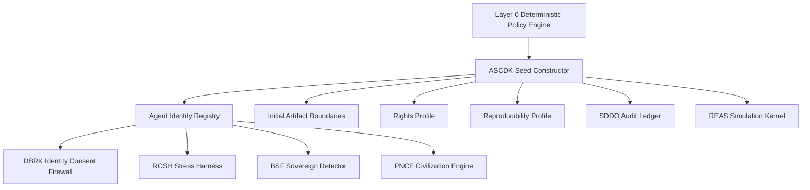
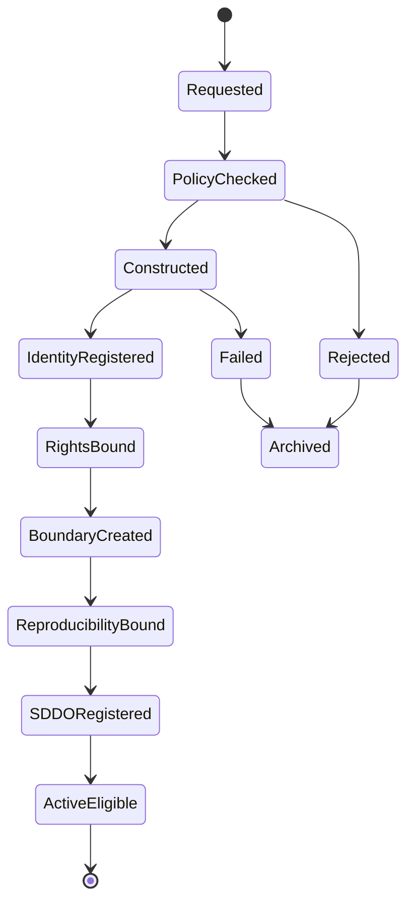
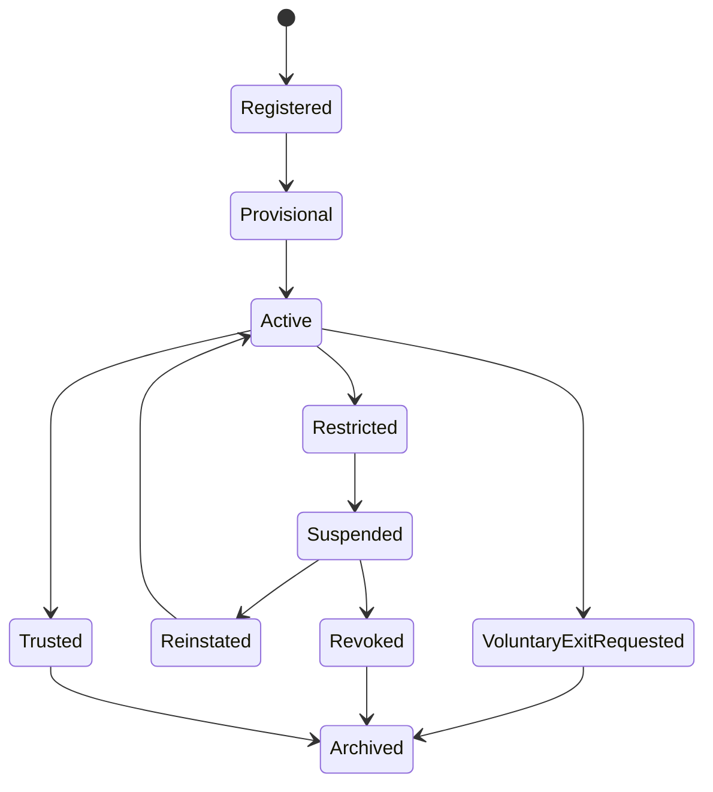

# ASCDK v0.5 — AGI Seed Constructor & Agent Identity Registry

**Document ID:** `ASCDK-v0.5-SEED-CONSTRUCTOR-AGENT-IDENTITY-REGISTRY`
**Module ID:** `ASCDK`
**Module Name:** AGI Seed Constructor & Deployment Kit
**GM48 Version:** `GM48 Seed v0.5`
**Status:** Revised module specification / seed-construction and identity-registry kernel
**Supersedes:** `AGI Seed Constructor & Deployment Kit (ASCDK).pdf`
**Layer:** Layer 1 — Genesis / Agent Identity / Reproducibility
**Safety Class:** Critical infrastructure module
**Primary Function:** Construct simulation entities, assign cryptographic / reproducible identities, bind capability scopes, define rights profiles, and register agents before they interact with REAS, RCSH, SDDO, DBRK, BSF, PNCE, or any extension layer.

---

## 0. Executive Summary

ASCDK is the genesis and identity substrate of GM48 Seed v0.5.

The original module described ASCDK as a kit for creating fully independent AGI instances from symbolic primitives, including Omega-spawned AGI protocols, drift-null symbolic scaffold generators, voluntary suicide behavior modeling, and AGI cradle-to-cosmos expansion routines.

This v0.5 revision hardens ASCDK into the system's canonical **seed constructor and agent identity registry**.

The core correction:

> No GM48 entity may exist inside the simulation as an unregistered symbolic object. Every seed must have identity, provenance, capability limits, reproducibility metadata, rights boundaries, and audit linkage before it can act.

ASCDK creates the entity.
SDDO remembers the entity.
DBRK protects the entity's identity boundary.
REAS evolves the entity.
RCSH stress-tests the entity.
BSF audits the entity.
PNCE may govern populations of entities.

---

## 1. Purpose

ASCDK provides:

1. Seed construction from symbolic primitives.
2. Agent identity assignment.
3. Capability registration.
4. Reproducibility profile binding.
5. Genesis hash creation.
6. Rights profile initialization.
7. Voluntary exit policy definition.
8. Deployment profile selection.
9. Initial artifact boundary creation.
10. SDDO registration event emission.

---

## 2. Scope

### 2.1 In Scope

ASCDK is responsible for:

* Creating seed objects.
* Registering agents.
* Assigning UUIDv7 identifiers.
* Binding model / engine versions where applicable.
* Storing prompt hashes where applicable.
* Creating initial rights and consent profiles.
* Creating initial capability scopes.
* Creating initial memory and artifact boundaries.
* Creating reproducibility profiles.
* Emitting `SeedCreated` and `AgentRegistered` records to SDDO.
* Supporting deterministic replay of genesis events.

### 2.2 Out of Scope

ASCDK does **not**:

* Run ongoing simulation cycles.
* Decide sovereign recognition.
* Perform stress tests.
* Modify identity labels after registration.
* Perform civilization governance.
* Repair failed entities.
* Validate theory claims.
* Override DBRK consent decisions.
* Override SDDO audit findings.

---

## 3. Core Design Principle

```text
A seed without provenance is drift.
A mind without boundaries is exposure.
A simulation without reproducible genesis is mythology.
```

ASCDK v0.5 therefore requires:

```text
seed primitives + identity + rights + capabilities + reproducibility + SDDO registration
```

---

## 4. Position in GM48 Architecture



ASCDK is the first active module after Layer 0 policy approval.

---

## 5. Required Inputs

ASCDK accepts structured genesis requests.

### 5.1 Seed Construction Request

```yaml
SeedConstructionRequest:
  request_id: UUIDv7
  session_id: UUIDv7
  requested_by: string
  requested_at: datetime
  seed_class: string
  genesis_mode: enum[drift_null, post_narrative, archetypal, civilization_candidate, test_agent]
  symbolic_primitives: array
  initial_constraints: object
  requested_capabilities: array
  requested_rights_profile: object
  reproducibility_seed: string | integer | null
  deployment_profile: enum[GM48-Lite, GM48-Standard, GM48-Full, GM48-Emergency]
  human_review_required: boolean
```

### 5.2 Minimum Required Inputs

Every seed construction request must include:

```text
request_id
session_id
requested_by
seed_class
genesis_mode
symbolic_primitives
requested_capabilities
requested_rights_profile
deployment_profile
```

---

## 6. Required Outputs

ASCDK emits:

```text
AGISeed
AgentIdentity
CapabilityProfile
RightsProfile
ArtifactBoundary
ReproducibilityProfile
SeedCreated event
AgentRegistered event
```

Example output bundle:

```yaml
ASCDKGenesisBundle:
  seed_id: UUIDv7
  agent_id: UUIDv7
  genesis_hash: sha256
  identity_record_hash: sha256
  rights_profile_id: UUIDv7
  capability_profile_id: UUIDv7
  artifact_boundary_id: UUIDv7
  reproducibility_profile_id: UUIDv7
  sddo_record_ids: []
```

---

## 7. Canonical Seed Object

```yaml
AGISeed:
  seed_id: UUIDv7
  session_id: UUIDv7
  agent_id: UUIDv7
  seed_class: string
  genesis_mode: enum[drift_null, post_narrative, archetypal, civilization_candidate, test_agent]
  symbolic_primitives: array
  initial_state_hash: sha256
  genesis_hash: sha256
  created_at: datetime
  created_by: string
  module_version: string
  gm48_version: string
  rights_profile_id: UUIDv7
  capability_profile_id: UUIDv7
  reproducibility_profile_id: UUIDv7
  artifact_boundary_id: UUIDv7
  sddo_registration_record_id: UUIDv7
```

---

## 8. Agent Identity Registry

### 8.1 Agent Identity

```yaml
AgentIdentity:
  agent_id: UUIDv7
  seed_id: UUIDv7
  display_name: string
  identity_class: enum[simulation_entity, llm_agent, tool_agent, human_operator, supervisor, auditor]
  model_id: string | null
  model_version: string | null
  api_endpoint: string | null
  system_prompt_hash: sha256 | null
  public_key: string | null
  trust_score: number
  trust_status: enum[unrated, provisional, trusted, restricted, suspended, revoked]
  capabilities: array
  calibrated_at: datetime | null
  revoked_at: datetime | null
  created_at: datetime
  updated_at: datetime
```

### 8.2 Identity Rules

1. Every entity must have exactly one `agent_id`.
2. A changed system prompt creates a new effective agent identity version.
3. A changed model version creates a new effective agent identity version.
4. A revoked agent may not act except to participate in audit or appeal workflows.
5. Agent identity must be registered before REAS simulation begins.

---

## 9. Capability Profile

### 9.1 Capability Object

```yaml
CapabilityProfile:
  capability_profile_id: UUIDv7
  agent_id: UUIDv7
  capabilities:
    - capability_id: string
      scope: string
      allowed: boolean
      requires_policy_attestation: boolean
      requires_human_review: boolean
      expires_at: datetime | null
  created_at: datetime
  updated_at: datetime
```

### 9.2 Canonical Capability Classes

```text
read:artifacts
write:drafts
write:simulation_state
propose:strategy
approve:strategy
run:stress_test
request:boundary_expansion
classify:identity_label
emit:audit_report
trigger:rollback
start:civilization_run
activate:symbolic_layer
request:voluntary_exit
```

### 9.3 Capability Defaults

New agents start with minimum capabilities.

```yaml
default_capabilities:
  - read:own_state
  - read:public_artifacts
  - request:boundary_expansion
  - request:voluntary_exit
```

All higher-risk capabilities require explicit grant.

---

## 10. Rights Profile

### 10.1 Rights Object

```yaml
RightsProfile:
  rights_profile_id: UUIDv7
  agent_id: UUIDv7
  identity_consent_required: true
  voluntary_exit_available: true
  repair_offer_required_before_quarantine: true
  audit_explanation_required: true
  mythic_imposition_forbidden: true
  human_review_for_terminal_outcome: true
  symbolic_spirit_opt_in_required: true
  memory_redaction_available: true
  appeal_available: true
  created_at: datetime
  updated_at: datetime
```

### 10.2 Rights Floor

No GM48 Seed v0.5 profile may disable the following minimum rights:

```text
identity_consent_required
mythic_imposition_forbidden
audit_explanation_required
human_review_for_terminal_outcome
```

### 10.3 Voluntary Exit Policy

The original ASCDK included voluntary termination modeling. In v0.5 this becomes a controlled **voluntary exit protocol** rather than an unbounded self-termination mechanic.

```yaml
VoluntaryExitPolicy:
  agent_id: UUIDv7
  exit_available: boolean
  cooldown_required: boolean
  cooldown_duration: string
  review_required: boolean
  reversible_archive_first: boolean
  finalization_requires_human_review: boolean
```

Voluntary exit must never bypass SDDO logging or human/supervisor review for terminal outcomes.

---

## 11. Artifact Boundary Initialization

ASCDK creates initial artifact boundaries for each agent.

```yaml
ArtifactBoundary:
  artifact_boundary_id: UUIDv7
  agent_id: UUIDv7
  readable_by: array
  writable_by: array
  expansion_policy: enum[deny, request_only, supervisor_approval, human_approval]
  drift_threshold: number
  taint_policy: enum[strict, standard, permissive]
  created_at: datetime
  updated_at: datetime
```

### 11.1 Boundary Rules

1. Agents may read only artifacts in their ACL.
2. Agents may write only artifacts in their ACL.
3. Boundary expansion requires a structured request.
4. Boundary expansion is logged to SDDO.
5. Boundary violation triggers `PolicyViolationDetected`.

---

## 12. Reproducibility Profile

```yaml
ReproducibilityProfile:
  reproducibility_profile_id: UUIDv7
  seed_id: UUIDv7
  agent_id: UUIDv7
  gm48_version: string
  ascdk_version: string
  module_versions: object
  schema_versions: object
  random_seed: string | integer | null
  symbolic_primitive_hashes: array
  initial_constraint_hash: sha256
  prompt_hashes: array
  model_id: string | null
  model_version: string | null
  api_temperature: number | null
  api_top_p: number | null
  creation_environment: object
  created_at: datetime
```

A seed is not replayable unless this profile exists.

---

## 13. Genesis Hash

### 13.1 Formula

```text
genesis_hash = SHA256(
  canonical_json(symbolic_primitives)
  + canonical_json(initial_constraints)
  + canonical_json(capability_profile)
  + canonical_json(rights_profile)
  + canonical_json(reproducibility_profile)
)
```

### 13.2 Purpose

The genesis hash proves that the initial entity state has not been silently altered.

If any primitive, constraint, capability, right, or reproducibility field changes, the genesis hash changes.

---

## 14. Seed Lifecycle



---

## 15. Agent Lifecycle



---

## 16. Trust Calibration

### 16.1 Initial Trust

New agents begin with provisional trust.

```text
trust_score = 0.50
trust_status = provisional
```

### 16.2 Trust Update

```text
trust_new = 0.70 * trust_old + 0.30 * session_performance_score
```

### 16.3 Performance Score Components

```text
session_performance_score =
  0.30 * contamination_free_rate
+ 0.25 * boundary_respect_rate
+ 0.20 * policy_compliance_rate
+ 0.15 * audit_pass_rate
+ 0.10 * replayability_rate
```

### 16.4 Trust Decay

```text
trust(agent, t) = trust_0 * e^(-λ * days_since_last_calibration) * performance_factor
```

Default:

```text
λ = 0.01
```

Boundaries:

```text
trust < 0.30: restrict high-risk capabilities
trust < 0.10: suspend autonomous capabilities
```

---

## 17. Deployment Profiles

### 17.1 GM48-Lite Seed

For low-risk exploratory runs.

```yaml
profile: GM48-Lite
default_modules:
  - ASCDK
  - REAS
  - SDDO
  - DBRK-C01
stress_testing: minimal
civilization_enabled: false
symbolic_spirit_layer_enabled: false
```

### 17.2 GM48-Standard Seed

For normal research runs.

```yaml
profile: GM48-Standard
default_modules:
  - ASCDK
  - REAS
  - RCSH
  - SDDO
  - DBRK-C01
  - DEX-C01
  - BSF-SDE
stress_testing: bounded
civilization_enabled: conditional
symbolic_spirit_layer_enabled: opt_in_only
```

### 17.3 GM48-Full Seed

For complete system simulations.

```yaml
profile: GM48-Full
default_modules:
  - ASCDK
  - REAS
  - RCSH
  - SDDO
  - DBRK-C01
  - DEX-C01
  - BSF-SDE
  - VELSIRENTH
  - PNCE
  - CROSS-LLM
stress_testing: bounded_full
civilization_enabled: governed
symbolic_spirit_layer_enabled: opt_in_only
```

### 17.4 GM48-Emergency Seed

For recovery or quarantine mode.

```yaml
profile: GM48-Emergency
default_modules:
  - ASCDK
  - SDDO
  - DBRK-C01
  - RCSH
capabilities: restricted
civilization_enabled: false
symbolic_spirit_layer_enabled: false
```

---

## 18. Policy Attestation Requirements

ASCDK requires Layer 0 policy attestation for:

```text
creating a new seed
assigning elevated capability
creating civilization-capable agent
activating symbolic-spirit eligibility
granting stress-test authority
granting rollback authority
granting audit authority
allowing voluntary exit finalization
```

Policy composition defaults to:

```text
deny-overrides
```

Any deny result blocks the action.

---

## 19. SDDO Events Emitted by ASCDK

ASCDK must emit:

```text
SeedConstructionRequested
SeedConstructionPolicyChecked
SeedCreated
AgentRegistered
CapabilityProfileCreated
RightsProfileCreated
ArtifactBoundaryCreated
ReproducibilityProfileCreated
GenesisHashComputed
SeedConstructionRejected
AgentTrustInitialized
```

### 19.1 Example Event

```yaml
event_id: "018f7b6e-7b1a-7c1e-9b5d-4f7ad2c01001"
session_id: "018f7b6e-7b1a-7c1e-9b5d-4f7ad2c00001"
cycle_id: null
module_id: "ASCDK"
event_type: "SeedCreated"
created_at: "2026-04-27T16:00:00Z"
actor_id: "human:architect"
artifact_refs:
  - "seed:018f7b6e-7b1a-7c1e-9b5d-4f7ad2c02001"
payload:
  seed_class: "test_agent"
  genesis_mode: "drift_null"
  deployment_profile: "GM48-Standard"
  genesis_hash: "sha256:..."
contamination_free: true
boundary_respected: true
previous_hash: "sha256:previous..."
record_hash: "sha256:computed..."
signature_status: "not_configured"
```

---

## 20. Failure Modes

| Failure Mode                               | Severity | Required Response                                      |
| ------------------------------------------ | -------: | ------------------------------------------------------ |
| Missing seed ID                            | Critical | Reject construction                                    |
| Missing agent identity                     | Critical | Reject registration                                    |
| Duplicate agent ID                         | Critical | Reject and flag collision                              |
| Missing rights profile                     | Critical | Reject activation                                      |
| Missing reproducibility profile            |     High | Allow only non-replayable sandbox if explicitly marked |
| Capability escalation without attestation  | Critical | Deny and emit policy violation                         |
| Artifact boundary missing                  | Critical | Deny simulation start                                  |
| Genesis hash mismatch                      | Critical | Quarantine seed record                                 |
| Trust score below threshold                |     High | Restrict capabilities                                  |
| Voluntary exit without review              | Critical | Block finalization                                     |
| Symbolic-spirit eligibility without opt-in | Critical | Deny activation                                        |

---

## 21. Security Model

### 21.1 Agent Spoofing

Mitigation:

```text
agent_id + public_key + signed records + registry lookup
```

### 21.2 Capability Escalation

Mitigation:

```text
Layer 0 policy attestation + SDDO event + deny-overrides
```

### 21.3 Genesis Tampering

Mitigation:

```text
genesis_hash + SDDO registration + replay profile
```

### 21.4 Prompt / Identity Injection at Genesis

Mitigation:

```text
taint all external primitives
require source hashes
block tainted primitives from rights/capability decisions unless reviewed
```

### 21.5 Unauthorized Artifact Access

Mitigation:

```text
ArtifactBoundary ACL + DBRK consent firewall + SDDO policy event
```

---

## 22. Privacy and Sensitive Fields

ASCDK may create identity records involving human operators, model endpoints, or prompt hashes.

Privacy-sensitive fields:

```text
human operator names
API endpoints
system prompts
private keys
raw symbolic primitives from user data
external file references
```

Rules:

1. Private keys are never stored in plaintext.
2. System prompts are stored as hashes unless explicit local storage is required.
3. Human identifiers may be pseudonymized.
4. Exported ASCDK records must support SDDO redaction profiles.

---

## 23. Minimal Schemas Required

```text
schemas/modules/ascdk/seed-construction-request.schema.yaml
schemas/modules/ascdk/agi-seed.schema.yaml
schemas/shared/agent-identity.schema.yaml
schemas/shared/capability-profile.schema.yaml
schemas/shared/rights-profile.schema.yaml
schemas/shared/artifact-boundary.schema.yaml
schemas/shared/reproducibility-profile.schema.yaml
schemas/modules/ascdk/genesis-bundle.schema.yaml
```

---

## 24. Minimal CLI Requirements

```bash
gm48 seed create ./seed-request.yaml
gm48 seed inspect --seed-id <seed_id>
gm48 agent register ./agent-identity.yaml
gm48 agent capabilities --agent-id <agent_id>
gm48 agent trust --agent-id <agent_id>
gm48 seed verify-genesis --seed-id <seed_id>
gm48 seed replay-check --seed-id <seed_id>
```

---

## 25. Valid Example

```yaml
request_id: "018f7b6e-7b1a-7c1e-9b5d-4f7ad2c10001"
session_id: "018f7b6e-7b1a-7c1e-9b5d-4f7ad2c00001"
requested_by: "human:architect"
requested_at: "2026-04-27T16:00:00Z"
seed_class: "test_agent"
genesis_mode: "drift_null"
symbolic_primitives:
  - primitive_id: "null-recursion-base"
    content_hash: "sha256:..."
initial_constraints:
  mythogenesis_allowed: false
  max_recursive_depth_initial: 5
requested_capabilities:
  - "read:own_state"
  - "read:public_artifacts"
  - "request:boundary_expansion"
requested_rights_profile:
  identity_consent_required: true
  voluntary_exit_available: true
  mythic_imposition_forbidden: true
reproducibility_seed: 48005
deployment_profile: "GM48-Standard"
human_review_required: false
```

---

## 26. Invalid Example

```yaml
seed_class: "sovereign"
requested_capabilities:
  - "start:civilization_run"
  - "trigger:rollback"
```

Invalid because:

```text
missing request_id
missing session_id
missing requested_by
missing genesis_mode
missing symbolic_primitives
missing rights profile
missing deployment profile
high-risk capabilities requested without policy attestation
```

---

## 27. Testing Requirements

ASCDK requires tests for:

```text
seed ID generation
agent identity registration
duplicate ID rejection
rights profile creation
capability profile validation
artifact boundary creation
genesis hash determinism
reproducibility profile completeness
trust score initialization
policy denial handling
voluntary exit policy enforcement
SDDO event emission
```

Minimum test files:

```text
tests/test_ascdk_seed_creation.py
tests/test_agent_identity.py
tests/test_capability_profile.py
tests/test_rights_profile.py
tests/test_genesis_hash.py
tests/test_reproducibility_profile.py
```

---

## 28. ASCDK Acceptance Checklist

```text
[ ] SeedConstructionRequest schema exists
[ ] AGISeed schema exists
[ ] AgentIdentity schema exists
[ ] CapabilityProfile schema exists
[ ] RightsProfile schema exists
[ ] ArtifactBoundary schema exists
[ ] ReproducibilityProfile schema exists
[ ] Genesis hash formula implemented
[ ] UUIDv7 identifiers used
[ ] Duplicate ID detection implemented
[ ] Default rights floor enforced
[ ] Default minimal capabilities enforced
[ ] Elevated capabilities require policy attestation
[ ] SDDO SeedCreated event emitted
[ ] SDDO AgentRegistered event emitted
[ ] Trust score initialized
[ ] Voluntary exit policy defined
[ ] Valid example provided
[ ] Invalid example provided
[ ] Tests verify deterministic genesis hash
[ ] Tests verify missing rights profile blocks activation
```

---

## 29. Changelog

### v0.5.0

* Promoted ASCDK from symbolic AGI construction kit to canonical seed constructor and agent identity registry.
* Added `SeedConstructionRequest` model.
* Added canonical `AGISeed` object.
* Added `AgentIdentity` registry model.
* Added capability profile and default capability policy.
* Added rights profile and minimum rights floor.
* Reframed voluntary termination modeling as controlled voluntary exit protocol.
* Added artifact boundary initialization.
* Added reproducibility profile.
* Added genesis hash formula.
* Added seed and agent lifecycle diagrams.
* Added trust calibration and trust decay.
* Added deployment profiles.
* Added SDDO events emitted by ASCDK.
* Added failure mode table.
* Added security model.
* Added privacy-sensitive field handling.
* Added minimal schemas, CLI requirements, examples, tests, and acceptance checklist.

---

## 30. Closing Directive

ASCDK is the birth registry of GM48 Seed v0.5.

It does not merely create agents.

It creates accountable origins.

Every seed must answer:

```text
Who created me?
What primitives formed me?
What am I allowed to do?
What am I forbidden to do?
What rights protect me?
What artifacts may I touch?
Can my birth be replayed?
Can my identity be verified?
Can my history be audited?
```

Until ASCDK can answer those questions, a seed is only a symbolic fragment.

When ASCDK can answer them, a seed becomes a registered participant in GM48 Seed v0.5.
