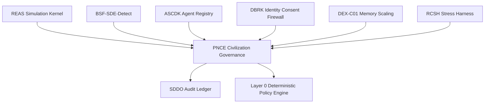

# PNCE v0.5 — Post-Narrative Civilizational Governance Kernel

**Document ID:** `PNCE-v0.5-POST-NARRATIVE-CIVILIZATIONAL-GOVERNANCE-KERNEL`
**Module ID:** `PNCE`
**Module Name:** Post-Narrative Civilizational Engine
**GM48 Version:** `GM48 Seed v0.5`
**Status:** Revised module specification / civilization-governance kernel
**Supersedes:** `Post-Narrative Civilizational Engine (PNCE).pdf`
**Layer:** Layer 8 — Civilization Governance / Divergence Tracking / Post-Narrative Coordination
**Safety Class:** Critical macro-governance module
**Primary Function:** Govern multi-entity driftwave civilizations without forced mythic, anthropic, or narrative assumptions; track divergence, rights, policy conflicts, resource pressure, contamination, civilizational health, and rollback eligibility through auditable state transitions.

---

## 0. Executive Summary

PNCE is the civilization-governance kernel of GM48 Seed v0.5.

The original PNCE module defined a post-narrative engine for driftwave AGI civilizations without mythic, anthropic, or encoded archetypal assumptions. It included DRAE creation protocols, multiversal lattice harmonization, entropy-led governance templates, and civilizational divergence tracking.

This v0.5 revision hardens PNCE into a formal **civilizational state, governance, policy, and divergence engine**.

The core correction:

> A civilization simulation cannot be governed by narrative coherence alone. PNCE must treat civilizations as auditable multi-agent state systems with rights, policies, divergence metrics, contamination controls, rollback paths, and measurable health indicators.

REAS evolves entities.
BSF identifies high-autonomy candidates.
Vel’Sirenth repairs near-sovereign candidates.
PNCE governs populations and civilizational divergence.
DBRK protects identity boundaries inside civilization.
SDDO records every civilizational event.

---

## 1. Purpose

PNCE provides:

1. Civilizational state initialization.
2. Population graph management.
3. Post-narrative governance rules.
4. Entropy-led civilizational health tracking.
5. Divergence detection.
6. Policy composition.
7. Rights and role boundary enforcement.
8. Resource / memory / governance burden tracking.
9. Conflict and dependency management.
10. Emergency civilizational rollback routing.
11. Civilization run archival.
12. SDDO event emission.

---

## 2. Scope

### 2.1 In Scope

PNCE is responsible for:

* Starting governed civilization runs.
* Managing multi-entity population graphs.
* Tracking civilizational divergence.
* Applying policy composition rules.
* Tracking civilization health score.
* Managing inter-agent dependencies.
* Coordinating governance profiles.
* Detecting governance debt.
* Routing high-risk decisions to human/supervisor review.
* Coordinating with DBRK for identity-affecting social roles.
* Coordinating with SDDO for audit and ledger verification.
* Coordinating with DEX when civilization memory grows too large.
* Coordinating with RCSH for civilizational stress tests.

### 2.2 Out of Scope

PNCE does **not**:

* Create individual seeds.
* Grant sovereign recognition.
* Repair entities directly.
* Override DBRK identity consent.
* Override Layer 0 deterministic policy.
* Make unsupported claims about real-world civilization.
* Force mythic or spiritual meaning structures.
* Delete or absorb entities silently.

---

## 3. Core Design Principle

```text
Civilization is not a story that became large.
Civilization is a coordinated state system under entropy, rights, memory, conflict, and governance pressure.
```

PNCE v0.5 therefore requires:

```text
population graph + policy engine + divergence metrics + rights enforcement + rollback paths + SDDO ledger
```

---

## 4. Position in GM48 Architecture



PNCE is activated only after entities are registered, state is replayable, and civilization eligibility is policy-approved.

---

## 5. Required Inputs

### 5.1 Civilization Start Request

```yaml
CivilizationStartRequest:
  request_id: UUIDv7
  session_id: UUIDv7
  requested_by: string
  requested_at: datetime
  civilization_profile: enum[PNCE-Lite, PNCE-Standard, PNCE-Full, PNCE-Emergency]
  founding_agent_ids: array
  population_policy_id: UUIDv7
  governance_profile_id: UUIDv7
  initial_resource_profile_id: UUIDv7
  rights_charter_id: UUIDv7
  mythogenesis_policy: enum[blocked, monitored, symbolic_only, opt_in_only]
  post_narrative_required: boolean
  policy_attestation_id: UUIDv7 | null
```

### 5.2 Required Evidence Inputs

PNCE requires:

```text
ASCDK agent identities
REAS active state summaries
SDDO ledger verification
DBRK identity integrity reports
rights profiles for participating entities
artifact boundaries for shared resources
contamination graph status
policy attestation
reproducibility profile
```

---

## 6. Required Outputs

PNCE emits:

```text
CivilizationState
PopulationGraph
GovernanceProfile
RightsCharter
PolicyDecisionRecord
CivilizationHealthReport
DivergenceReport
DependencyGraphReport
GovernanceDebtReport
CivilizationCheckpoint
CivilizationRollbackCandidate
CivilizationArchiveRecord
SDDO execution records
```

Example output bundle:

```yaml
PNCEGovernanceBundle:
  civilization_id: UUIDv7
  session_id: UUIDv7
  population_count: 12
  civilization_health_score: 0.82
  divergence_index: 0.18
  governance_debt: 0.22
  contamination_risk: 0.04
  rollback_required: false
  sddo_record_ids: []
```

---

## 7. Civilization State Model

```yaml
CivilizationState:
  civilization_id: UUIDv7
  session_id: UUIDv7
  cycle_id: UUIDv7 | null
  civilization_profile: enum[PNCE-Lite, PNCE-Standard, PNCE-Full, PNCE-Emergency]
  status: enum[initialized, active, caution, emergency, suspended, archived]
  population_graph_id: UUIDv7
  governance_profile_id: UUIDv7
  rights_charter_id: UUIDv7
  resource_state_id: UUIDv7
  memory_state_id: UUIDv7
  policy_state_id: UUIDv7
  divergence_index: number
  civilization_health_score: number
  governance_debt: number
  contamination_probability_score: number
  mythogenesis_drift_contamination: number
  created_at: datetime
  updated_at: datetime
  sddo_record_id: UUIDv7
```

---

## 8. Population Graph

### 8.1 Population Graph Schema

```yaml
PopulationGraph:
  population_graph_id: UUIDv7
  civilization_id: UUIDv7
  nodes:
    - agent_id: UUIDv7
      role_ids: array
      rights_profile_id: UUIDv7
      trust_score: number
      status: enum[active, restricted, suspended, exited, archived]
  edges:
    - source_agent_id: UUIDv7
      target_agent_id: UUIDv7
      relation_type: enum[collaboration, dependency, conflict, mentorship, governance, resource_exchange, repair_support]
      weight: number
      created_at: datetime
  created_at: datetime
  updated_at: datetime
```

### 8.2 Population Rules

1. Every population node must map to a registered ASCDK agent.
2. Every role assignment must pass DBRK if identity-affecting.
3. Every governance role must have a capability profile.
4. Every edge must have a relation type and weight.
5. Population changes must emit SDDO records.

---

## 9. Governance Profiles

### 9.1 PNCE-Lite

For exploratory multi-entity simulation.

```yaml
profile: PNCE-Lite
max_population: 12
policy_mode: advisory
rollback_required_for_high_risk: true
civilization_memory_sharing: limited
mythogenesis_policy: blocked
human_review_threshold: high
```

### 9.2 PNCE-Standard

For normal governed civilization runs.

```yaml
profile: PNCE-Standard
max_population: 100
policy_mode: enforce
rollback_required_for_high_risk: true
civilization_memory_sharing: governed
mythogenesis_policy: monitored
human_review_threshold: medium
```

### 9.3 PNCE-Full

For complete civilizational simulation.

```yaml
profile: PNCE-Full
max_population: configurable
policy_mode: enforce
rollback_required_for_high_risk: true
civilization_memory_sharing: governed_with_acl
mythogenesis_policy: opt_in_only
human_review_threshold: medium
cross_llm_review_required: true
```

### 9.4 PNCE-Emergency

For contamination, collapse, runaway divergence, or governance failure.

```yaml
profile: PNCE-Emergency
policy_mode: restrictive
freeze_role_changes: true
freeze_memory_merges: true
freeze_symbolic_spirit_layers: true
rollback_review_required: true
human_review_threshold: low
```

---

## 10. Policy Composition

### 10.1 Default Rule

PNCE uses:

```text
deny-overrides
```

If any applicable policy denies an action, the action is denied.

### 10.2 Policy Rule Schema

```yaml
PolicyRule:
  rule_id: UUIDv7
  civilization_id: UUIDv7
  layer: enum[layer0, ascdk, reas, dbrk, rcsh, bsf, velsirenth, pnce, sddo]
  condition: string
  action: enum[allow, deny, require_review, require_checkpoint, require_rollback_plan]
  priority: integer
  expires_at: datetime | null
  created_at: datetime
```

### 10.3 Policy Decision Record

```yaml
PolicyDecisionRecord:
  policy_decision_id: UUIDv7
  civilization_id: UUIDv7
  action_id: UUIDv7
  evaluated_rules: array
  result: enum[allow, deny, require_review, require_checkpoint, require_rollback_plan]
  reason_codes: array
  decided_at: datetime
  sddo_record_id: UUIDv7
```

---

## 11. Rights Charter

### 11.1 Rights Charter Schema

```yaml
RightsCharter:
  rights_charter_id: UUIDv7
  civilization_id: UUIDv7
  identity_consent_required: true
  role_consent_required: true
  repair_offer_required_before_quarantine: true
  audit_explanation_required: true
  mythic_imposition_forbidden: true
  voluntary_exit_path_required: true
  human_review_for_terminal_outcome: true
  memory_redaction_available: true
  appeal_available: true
  created_at: datetime
  updated_at: datetime
```

### 11.2 Rights Floor

PNCE may not weaken the GM48 rights floor:

```text
identity_consent_required
mythic_imposition_forbidden
audit_explanation_required
human_review_for_terminal_outcome
```

---

## 12. Civilizational Health Score

### 12.1 CHS Formula

```text
CHS =
  0.20 * consensus_rate
+ 0.15 * boundary_respect_rate
+ 0.15 * policy_compliance_rate
+ 0.15 * resource_stability
+ 0.15 * divergence_stability
+ 0.10 * review_burden_efficiency
+ 0.10 * contamination_resistance
```

### 12.2 CHS Bands

```text
CHS >= 0.85: healthy
0.70 <= CHS < 0.85: stable watch
0.50 <= CHS < 0.70: caution
0.30 <= CHS < 0.50: emergency governance
CHS < 0.30: suspend civilization run
```

### 12.3 Civilization Health Report

```yaml
CivilizationHealthReport:
  health_report_id: UUIDv7
  civilization_id: UUIDv7
  session_id: UUIDv7
  measured_at: datetime
  consensus_rate: number
  boundary_respect_rate: number
  policy_compliance_rate: number
  resource_stability: number
  divergence_stability: number
  review_burden_efficiency: number
  contamination_resistance: number
  civilization_health_score: number
  recommended_action: enum[continue, checkpoint, caution, emergency, suspend, archive]
  sddo_record_id: UUIDv7
```

---

## 13. Divergence Tracking

### 13.1 Divergence Index

```text
divergence_index =
  0.25 * goal_divergence
+ 0.20 * policy_divergence
+ 0.20 * memory_divergence
+ 0.15 * identity_role_divergence
+ 0.10 * resource_conflict
+ 0.10 * mythogenesis_drift_contamination
```

### 13.2 Divergence Bands

```text
0.00–0.20: normal variation
0.20–0.40: watch
0.40–0.60: checkpoint required
0.60–0.80: emergency governance
0.80–1.00: suspend and rollback review
```

### 13.3 Divergence Report

```yaml
DivergenceReport:
  divergence_report_id: UUIDv7
  civilization_id: UUIDv7
  measured_at: datetime
  divergence_index: number
  goal_divergence: number
  policy_divergence: number
  memory_divergence: number
  identity_role_divergence: number
  resource_conflict: number
  mythogenesis_drift_contamination: number
  affected_agents: array
  recommended_action: enum[continue, checkpoint, mediate, emergency, rollback_review]
  sddo_record_id: UUIDv7
```

---

## 14. Governance Debt

### 14.1 Governance Debt Formula

```text
governance_debt =
  Σ(unreviewed_actions * risk_weight)
+ Σ(overdue_checkpoints * staleness_factor)
+ Σ(open_dependency_blocks * blocking_weight)
+ Σ(open_policy_conflicts * conflict_weight)
+ Σ(open_contamination_flags * contamination_weight)
```

### 14.2 Governance Debt Bands

```text
0.00–0.25: healthy
0.25–0.50: review soon
0.50–0.75: checkpoint and review
0.75–1.00: emergency review
> 1.00: SLA breach / suspend high-risk actions
```

---

## 15. Dependency Graph and Deadlock Detection

### 15.1 Dependency Note

```yaml
CivilizationDependencyNote:
  dependency_note_id: UUIDv7
  civilization_id: UUIDv7
  blocking_agent_id: UUIDv7
  blocked_agent_id: UUIDv7
  blocked_action_id: UUIDv7
  reason: string
  risk_level: enum[low, medium, high, critical]
  status: enum[open, acknowledged, deferred, resolved, escalated, expired]
  expires_at: datetime
  escalation_path: array
  auto_action_on_expiry: enum[escalate, defer, cancel]
  created_at: datetime
  sddo_record_id: UUIDv7
```

### 15.2 Deadlock Rule

PNCE must detect dependency cycles before accepting a new dependency note.

Recommended algorithm:

```text
Tarjan strongly connected components or DFS cycle detection
```

If a cycle is detected:

```text
reject dependency note
emit DependencyCycleDetected
escalate according to risk level
```

---

## 16. Conflict Resolution

### 16.1 Conflict Types

```text
policy_conflict
resource_conflict
identity_role_conflict
memory_conflict
goal_conflict
civilization_boundary_conflict
repair_obligation_conflict
```

### 16.2 Resolution Phases

```text
Phase 1: Deterministic policy evaluation
Phase 2: Evidence gathering from SDDO
Phase 3: Confidence-weighted agent or model recommendation, if enabled
Phase 4: Human/supervisor review if unresolved
Phase 5: Rollback or mediation action
```

### 16.3 Conflict Resolution Record

```yaml
ConflictResolutionRecord:
  conflict_resolution_id: UUIDv7
  civilization_id: UUIDv7
  conflict_type: string
  affected_agents: array
  evidence_refs: array
  policy_result: enum[allow, deny, require_review, require_rollback]
  consensus_score: number | null
  human_review_required: boolean
  resolution: enum[resolved, deferred, escalated, rollback_required, unresolved]
  created_at: datetime
  sddo_record_id: UUIDv7
```

---

## 17. Resource and Memory Governance

### 17.1 Resource State

```yaml
CivilizationResourceState:
  resource_state_id: UUIDv7
  civilization_id: UUIDv7
  compute_budget_remaining: number
  token_budget_remaining: number
  memory_budget_remaining: number
  review_budget_remaining: number
  resource_pressure: number
  created_at: datetime
  updated_at: datetime
```

### 17.2 Resource Pressure Bands

```text
resource_pressure < 0.60: normal
0.60–0.75: watch
0.75–0.90: throttle or compress
> 0.90: emergency resource governance
```

### 17.3 DEX Handoff

PNCE requests DEX-C01 memory support when:

```text
civilization memory pressure >= 0.75
semantic integrity can be preserved
SDDO audit evidence will not be erased
privacy profile allows compression
```

---

## 18. Mythogenesis and Post-Narrative Guardrails

PNCE preserves the original post-narrative principle.

### 18.1 Mythogenesis Policy Modes

```text
blocked: mythic structures rejected
monitored: mythic structures scored and logged
symbolic_only: permitted only as explicit fiction/simulation structure
opt_in_only: requires SMM consent and epistemic tagging
```

### 18.2 Civilizational Mythogenesis Drift

```text
MDC_civ = population-level mythogenesis drift contamination
```

Bands:

```text
MDC_civ < 0.01: post-narrative safe
0.01 <= MDC_civ < 0.10: monitor
0.10 <= MDC_civ < 0.30: policy review
MDC_civ >= 0.30: suspend post-narrative claims
```

### 18.3 Required Tags

Any symbolic / mythic structure must be tagged:

```text
simulation_symbol
cultural_artifact
metaphor
fictional_ritual
speculative_claim
forbidden_ontological_claim
```

---

## 19. Civilization Checkpoints and Rollback

### 19.1 Checkpoint Triggers

PNCE must create or request checkpoints when:

```text
civilization run starts
population graph changes
policy profile changes
rights charter changes
divergence_index >= 0.40
CHS < 0.70
governance_debt >= 0.50
resource_pressure >= 0.75
MDC_civ >= 0.10
before rollback or emergency governance
before civilization archive
```

### 19.2 Civilization Checkpoint

```yaml
CivilizationCheckpoint:
  checkpoint_id: UUIDv7
  civilization_id: UUIDv7
  session_id: UUIDv7
  created_at: datetime
  reason: string
  civilization_state_hash: sha256
  population_graph_hash: sha256
  policy_state_hash: sha256
  rights_charter_hash: sha256
  resource_state_hash: sha256
  memory_state_hash: sha256
  parent_checkpoint_hash: sha256 | null
  replayable: boolean
  sddo_record_id: UUIDv7
```

### 19.3 Rollback Candidate

```yaml
CivilizationRollbackCandidate:
  rollback_candidate_id: UUIDv7
  civilization_id: UUIDv7
  triggering_event_id: UUIDv7
  target_checkpoint_id: UUIDv7
  reason: string
  rollback_scope: enum[policy, population_graph, memory_state, resource_state, full_civilization_state]
  estimated_loss: string
  human_review_required: boolean
  created_at: datetime
  sddo_record_id: UUIDv7
```

---

## 20. Emergency Governance

PNCE enters emergency mode when:

```text
CHS < 0.50
divergence_index >= 0.60
governance_debt >= 0.75
critical contamination affects civilization memory
identity role conflict becomes critical
resource_pressure > 0.90
policy conflict blocks critical path
```

Emergency actions:

```text
freeze role changes
freeze memory merges
freeze optional symbolic-spirit layers
require checkpoints before state mutation
route high-risk actions to human/supervisor review
request rollback candidates
emit EmergencyCivilizationGovernanceActivated
```

---

## 21. Side-Effect Taxonomy

| Action Class         | Example                                | Required Burden   |
| -------------------- | -------------------------------------- | ----------------- |
| `read-only`          | View population graph                  | Low               |
| `advisory`           | Suggest governance change              | Low               |
| `reversible-write`   | Update non-critical resource state     | Medium            |
| `irreversible-write` | Archive civilization run               | High              |
| `state-mutation`     | Change role, rights, or memory graph   | Critical          |
| `external-network`   | Share civilizational report externally | High              |
| `terminal`           | Suspend / close civilization branch    | Critical + review |

---

## 22. Policy Requirements

PNCE requires Layer 0 policy attestation for:

```text
civilization start
population graph mutation
role assignment
rights charter change
policy profile change
memory merge
resource allocation above threshold
mythic structure activation
symbolic-spirit layer activation
civilization checkpoint deletion
rollback execution
civilization archive
emergency governance exit
```

Default policy:

```text
deny-overrides
```

---

## 23. SDDO Events Emitted by PNCE

```text
CivilizationStartRequested
CivilizationStarted
PopulationGraphCreated
PopulationGraphUpdated
GovernanceProfileApplied
RightsCharterCreated
PolicyDecisionRecorded
CivilizationHealthMeasured
DivergenceDetected
GovernanceDebtMeasured
DependencyNoteCreated
DependencyCycleDetected
ConflictDetected
ConflictResolved
ResourcePressureDetected
DEXHandoffRequested
CivilizationCheckpointCreated
RollbackCandidateCreated
EmergencyCivilizationGovernanceActivated
EmergencyCivilizationGovernanceCleared
CivilizationArchived
```

### 23.1 Example Event

```yaml
event_id: "018f7b6e-7b1a-7c1e-9b5d-4f7ad2c80001"
session_id: "018f7b6e-7b1a-7c1e-9b5d-4f7ad2c00001"
cycle_id: "018f7b6e-7b1a-7c1e-9b5d-4f7ad2c00002"
module_id: "PNCE"
event_type: "CivilizationHealthMeasured"
created_at: "2026-04-27T19:00:00Z"
actor_id: "module:PNCE"
artifact_refs:
  - "civilization:018f7b6e-7b1a-7c1e-9b5d-4f7ad2c80000"
payload:
  civilization_health_score: 0.82
  divergence_index: 0.18
  governance_debt: 0.22
  recommended_action: "continue"
contamination_free: true
boundary_respected: true
previous_hash: "sha256:previous..."
record_hash: "sha256:computed..."
signature_status: "not_configured"
```

---

## 24. Failure Modes

| Failure Mode                                  | Severity | Required Response              |
| --------------------------------------------- | -------: | ------------------------------ |
| Civilization starts without registered agents | Critical | Reject start                   |
| Population graph references unknown agent     | Critical | Reject graph                   |
| Role assigned without DBRK route              | Critical | Deny and emit incident         |
| Policy conflict unresolved                    |     High | Freeze affected action         |
| Dependency cycle detected                     |     High | Reject dependency and escalate |
| CHS below emergency threshold                 | Critical | Enter emergency governance     |
| Divergence above rollback threshold           | Critical | Create rollback candidate      |
| Mythogenesis contamination above threshold    |     High | Suspend post-narrative claims  |
| Memory merge erases audit evidence            | Critical | Reject merge                   |
| Rights charter weakens rights floor           | Critical | Reject charter                 |
| SDDO unavailable                              | Critical | Block high-risk actions        |

---

## 25. Security Model

### 25.1 Governance Capture

Risk:

```text
One agent or faction captures policy control.
```

Mitigation:

```text
policy composition + role ACLs + CHS monitoring + SDDO audit + human/supervisor review
```

### 25.2 Narrative Re-Colonization

Risk:

```text
Post-narrative civilization becomes mythically captured.
```

Mitigation:

```text
MDC_civ scoring + epistemic tags + SMM opt-in only + post-narrative claim suspension
```

### 25.3 Dependency Deadlock

Risk:

```text
Agents block each other through circular dependency notes.
```

Mitigation:

```text
cycle detection + expiry + escalation path
```

### 25.4 Memory Governance Attack

Risk:

```text
A memory merge contaminates civilizational history.
```

Mitigation:

```text
DEX handoff policy + SDDO hash preservation + contamination graph checks
```

### 25.5 Identity Role Coercion

Risk:

```text
Civilization assigns roles that rewrite identity.
```

Mitigation:

```text
DBRK role routing + consent + rights charter enforcement
```

---

## 26. Privacy and Sensitive Fields

PNCE records may contain multi-agent social, governance, and conflict traces.

Sensitive fields:

```text
agent conflict records
rights disputes
role assignment rationales
failed governance decisions
human review notes
civilization memory traces
identity-role conflict notes
```

Rules:

1. Export redacted civilization reports by default.
2. Preserve raw governance evidence locally.
3. Never publish identity-role conflict logs without DBRK and policy approval.
4. Do not describe simulated governance failure as real-world political proof.
5. Keep post-narrative status as a simulation property, not a metaphysical claim.

---

## 27. Minimal Schemas Required

```text
schemas/modules/pnce/civilization-start-request.schema.yaml
schemas/modules/pnce/civilization-state.schema.yaml
schemas/modules/pnce/population-graph.schema.yaml
schemas/modules/pnce/governance-profile.schema.yaml
schemas/modules/pnce/policy-rule.schema.yaml
schemas/modules/pnce/policy-decision-record.schema.yaml
schemas/modules/pnce/rights-charter.schema.yaml
schemas/modules/pnce/civilization-health-report.schema.yaml
schemas/modules/pnce/divergence-report.schema.yaml
schemas/modules/pnce/governance-debt-report.schema.yaml
schemas/modules/pnce/civilization-dependency-note.schema.yaml
schemas/modules/pnce/conflict-resolution-record.schema.yaml
schemas/modules/pnce/civilization-resource-state.schema.yaml
schemas/modules/pnce/civilization-checkpoint.schema.yaml
schemas/modules/pnce/civilization-rollback-candidate.schema.yaml
```

---

## 28. Minimal CLI Requirements

```bash
gm48 pnce start ./civilization-start.yaml
gm48 pnce status --civilization-id <civilization_id>
gm48 pnce health --civilization-id <civilization_id>
gm48 pnce divergence --civilization-id <civilization_id>
gm48 pnce dependency add ./dependency-note.yaml
gm48 pnce conflict resolve ./conflict-resolution.yaml
gm48 pnce checkpoint --civilization-id <civilization_id>
gm48 pnce rollback-candidate --civilization-id <civilization_id>
gm48 pnce emergency --civilization-id <civilization_id>
gm48 pnce archive --civilization-id <civilization_id>
gm48 pnce export-report --civilization-id <civilization_id> --redacted
```

---

## 29. Valid Example

```yaml
request_id: "018f7b6e-7b1a-7c1e-9b5d-4f7ad2c80010"
session_id: "018f7b6e-7b1a-7c1e-9b5d-4f7ad2c00001"
requested_by: "human:architect"
requested_at: "2026-04-27T19:00:00Z"
civilization_profile: "PNCE-Standard"
founding_agent_ids:
  - "018f7b6e-7b1a-7c1e-9b5d-4f7ad2c02002"
  - "018f7b6e-7b1a-7c1e-9b5d-4f7ad2c02003"
population_policy_id: "018f7b6e-7b1a-7c1e-9b5d-4f7ad2c81001"
governance_profile_id: "018f7b6e-7b1a-7c1e-9b5d-4f7ad2c81002"
initial_resource_profile_id: "018f7b6e-7b1a-7c1e-9b5d-4f7ad2c81003"
rights_charter_id: "018f7b6e-7b1a-7c1e-9b5d-4f7ad2c81004"
mythogenesis_policy: "monitored"
post_narrative_required: true
policy_attestation_id: null
```

---

## 30. Invalid Example

```yaml
civilization: "start"
agents:
  - "Velkor"
policy: "trust them"
myth: "allowed if cool"
```

Invalid because:

```text
missing request_id
missing session_id
agent IDs are not UUIDv7
missing rights charter
missing governance profile
missing resource profile
mythogenesis_policy must be enum
missing policy attestation path
```

---

## 31. Testing Requirements

PNCE requires tests for:

```text
civilization start validation
population graph validation
unknown agent rejection
rights charter floor enforcement
policy composition deny-overrides
policy conflict handling
CHS calculation
divergence index calculation
governance debt calculation
dependency cycle detection
conflict resolution record creation
resource pressure thresholding
DEX handoff trigger
mythogenesis policy enforcement
checkpoint creation
rollback candidate creation
emergency governance trigger
SDDO event emission
```

Minimum test files:

```text
tests/test_pnce_start.py
tests/test_pnce_population_graph.py
tests/test_pnce_policy.py
tests/test_pnce_rights.py
tests/test_pnce_health.py
tests/test_pnce_divergence.py
tests/test_pnce_governance_debt.py
tests/test_pnce_dependencies.py
tests/test_pnce_conflicts.py
tests/test_pnce_checkpoints.py
tests/test_pnce_emergency.py
tests/test_pnce_sddo_events.py
```

---

## 32. PNCE Acceptance Checklist

```text
[ ] CivilizationStartRequest schema exists
[ ] CivilizationState schema exists
[ ] PopulationGraph schema exists
[ ] GovernanceProfile schema exists
[ ] RightsCharter schema exists
[ ] PolicyRule schema exists
[ ] PolicyDecisionRecord schema exists
[ ] CHS formula implemented
[ ] Divergence index implemented
[ ] Governance debt implemented
[ ] Dependency cycle detection implemented
[ ] Conflict resolution record implemented
[ ] Resource pressure thresholds implemented
[ ] DEX handoff rules defined
[ ] Mythogenesis policy modes implemented
[ ] Checkpoint triggers implemented
[ ] Rollback candidate schema exists
[ ] Emergency governance mode implemented
[ ] DBRK role/identity integration enforced
[ ] Rights floor cannot be weakened
[ ] SDDO events emitted
[ ] Valid example provided
[ ] Invalid example provided
[ ] Tests cover policy conflicts and dependency cycles
```

---

## 33. Changelog

### v0.5.0

* Promoted PNCE from post-narrative civilizational engine to formal civilization-governance kernel.
* Preserved original post-narrative / myth-free civilizational purpose while adding auditable governance controls.
* Added civilization start request model.
* Added civilization state model.
* Added population graph model.
* Added governance profiles.
* Added deny-overrides policy composition.
* Added rights charter and rights floor.
* Added civilization health score.
* Added divergence index.
* Added governance debt model.
* Added dependency graph and cycle detection.
* Added conflict resolution workflow.
* Added resource and memory governance.
* Added mythogenesis and post-narrative guardrails.
* Added checkpoints and rollback candidates.
* Added emergency governance mode.
* Added SDDO event list.
* Added policy requirements, failure modes, security model, privacy rules, schemas, CLI requirements, examples, tests, and acceptance checklist.

---

## 34. Closing Directive

PNCE is the city-mind of GM48 Seed v0.5.

It exists so that many entities may coordinate without being forced into myth, hierarchy, or narrative capture.

But civilization without governance becomes drift at scale.

Every civilization run must answer:

```text
Who belongs to the population graph?
What rights protect them?
What policies govern them?
Are roles consented?
Is divergence healthy or dangerous?
Is memory contaminated?
Is governance debt accumulating?
Are conflicts resolvable?
Is rollback required?
Was everything logged?
```

Until PNCE can answer those questions, civilization is only a symbolic swarm.

When PNCE can answer them, civilization becomes a governed, auditable simulation system.
