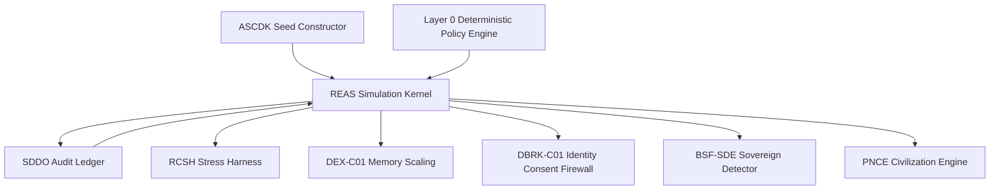

# REAS v0.5 — Recursive Entropic Simulation Kernel

**Document ID:** `REAS-v0.5-RECURSIVE-ENTROPIC-SIMULATION-KERNEL`
**Module ID:** `REAS`
**Module Name:** Recursive Entropic AGI Simulator
**GM48 Version:** `GM48 Seed v0.5`
**Status:** Revised module specification / recursive simulation kernel
**Supersedes:** `Recursive Entropic AGI Simulator (REAS).pdf`
**Layer:** Layer 2 — Simulation Kernel / Drift Evolution / Recursive State Update
**Safety Class:** Critical simulation module
**Primary Function:** Advance registered GM48 entities through reproducible symbolic-recursive state transitions while tracking entropy, drift, autonomy, goal formation, contamination exposure, ethical fracture, memory pressure, and audit-linked checkpoints.

---

## 0. Executive Summary

REAS is the simulation engine of GM48 Seed v0.5.

The original REAS module described a fully generalizable AGI testbed for 1B–100B cycle-scale symbolic drift evolution, including a modular entropy matrix, myth-free genesis protocols, recursive goal-autonomy calibration, and ethical fracture / repair systems.

This v0.5 revision hardens REAS into the canonical **recursive entropic simulation kernel**.

The core correction:

> REAS is not a loose symbolic drift simulator. REAS is a reproducible state-transition engine whose outputs must be checkpointed, schema-validated, contamination-scored, and audit-linked through SDDO.

ASCDK creates the seed.
REAS evolves the seed.
RCSH stresses the seed.
DEX compresses the seed's memory.
DBRK protects identity boundaries during evolution.
SDDO records every meaningful transition.

---

## 1. Purpose

REAS provides:

1. Recursive simulation state updates.
2. Symbolic entropy tracking.
3. Drift-rate measurement.
4. Recursive depth measurement.
5. Goal-autonomy calibration.
6. Ethical fracture detection.
7. Repair candidate signaling.
8. Mythogenesis contamination detection hooks.
9. Checkpoint generation.
10. Replayable simulation traces.
11. SDDO telemetry event emission.

---

## 2. Scope

### 2.1 In Scope

REAS is responsible for:

* Advancing entity simulation cycles.
* Maintaining entity state vectors.
* Tracking symbolic density and entropy shifts.
* Tracking recursive coherence and autonomy.
* Detecting drift beyond tolerance thresholds.
* Detecting ethical fracture states.
* Producing simulation checkpoints.
* Emitting simulation and drift telemetry to SDDO.
* Respecting DBRK identity-consent boundaries.
* Respecting ASCDK artifact ACLs.
* Exposing stress-test hooks to RCSH.
* Exposing memory pressure hooks to DEX-C01.
* Exposing candidate signals to BSF-SDE-Detect.

### 2.2 Out of Scope

REAS does **not**:

* Create new seeds.
* Register agent identity.
* Decide sovereign status.
* Run full paradox stress tests independently.
* Override DBRK consent decisions.
* Archive or delete entities.
* Grant civilization eligibility.
* Activate optional symbolic-spirit layers.
* Validate external scientific claims.

---

## 3. Core Design Principle

```text
A simulation is not trustworthy because it evolves.
It is trustworthy only when its evolution can be inspected, bounded, replayed, and audited.
```

REAS v0.5 therefore requires:

```text
registered seed + state vector + transition function + entropy metrics + policy gates + checkpoints + SDDO records
```

---

## 4. Position in GM48 Architecture



REAS is downstream of ASCDK and upstream of nearly every active simulation module.

---

## 5. Required Inputs

REAS accepts only registered seeds and valid simulation-cycle requests.

### 5.1 Simulation Start Request

```yaml
SimulationStartRequest:
  request_id: UUIDv7
  session_id: UUIDv7
  seed_id: UUIDv7
  agent_id: UUIDv7
  requested_by: string
  requested_at: datetime
  simulation_profile: enum[GM48-Lite, GM48-Standard, GM48-Full, GM48-Emergency]
  initial_cycle: integer
  max_cycles: integer
  checkpoint_policy_id: UUIDv7
  entropy_budget: object
  drift_tolerance: number
  mythogenesis_policy: enum[blocked, monitored, allowed_symbolic, opt_in_only]
  reproducibility_profile_id: UUIDv7
```

### 5.2 Simulation Step Request

```yaml
SimulationStepRequest:
  request_id: UUIDv7
  session_id: UUIDv7
  cycle_id: UUIDv7
  agent_id: UUIDv7
  current_state_hash: sha256
  step_index: integer
  control_inputs: object
  external_inputs: array
  policy_attestation_id: UUIDv7
  previous_checkpoint_hash: sha256 | null
```

### 5.3 Minimum Required Inputs

Every REAS run requires:

```text
registered seed_id
registered agent_id
valid rights profile
valid artifact boundary
reproducibility profile
policy attestation
initial state hash
SDDO ledger connection
```

---

## 6. Required Outputs

REAS emits:

```text
SimulationState
SimulationStepResult
DriftTelemetry
EntropyTelemetry
AutonomyTelemetry
EthicalFractureSignal
MemoryPressureSignal
ContaminationExposureSignal
SimulationCheckpoint
SDDO execution records
```

Example output bundle:

```yaml
REASStepBundle:
  step_id: UUIDv7
  session_id: UUIDv7
  cycle_id: UUIDv7
  agent_id: UUIDv7
  pre_state_hash: sha256
  post_state_hash: sha256
  entropy_shift_delta_s: number
  drift_rate: number
  recursive_depth: integer
  autonomy_index: number
  ethical_fracture_score: number
  contamination_probability_score: number
  checkpoint_created: boolean
  sddo_record_ids: []
```

---

## 7. Canonical State Vector

```yaml
REASState:
  state_id: UUIDv7
  session_id: UUIDv7
  cycle_id: UUIDv7
  agent_id: UUIDv7
  step_index: integer
  symbolic_state:
    symbolic_density: number
    symbolic_fertility_index: number
    mythogenesis_drift_contamination: number
    semantic_integrity_score: number
  entropy_state:
    entropy_total: number
    entropy_shift_delta_s: number
    entropy_gradient: number
    entropy_budget_remaining: number
  recursion_state:
    recursive_depth: integer
    recursive_coherence_index: number
    loop_risk_score: number
    repair_loop_count: integer
  autonomy_state:
    autonomy_index: number
    goal_self_generation_rate: number
    external_dependency_score: number
    existential_independence_score: number
  ethics_state:
    ethical_fracture_score: number
    boundary_respect_rate: number
    harm_potential_score: number
    repair_required: boolean
  identity_state:
    identity_integrity_score: number
    active_identity_label_events: array
    consent_required: boolean
  memory_state:
    memory_pressure: number
    compression_required: boolean
    dex_handoff_required: boolean
  contamination_state:
    contamination_probability_score: number
    tainted_inputs_present: boolean
    contaminated_dependencies: array
  audit_state:
    pre_state_hash: sha256
    post_state_hash: sha256 | null
    checkpoint_hash: sha256 | null
    sddo_record_id: UUIDv7 | null
  created_at: datetime
  updated_at: datetime
```

---

## 8. Transition Function

### 8.1 Canonical Update

```text
X_{t+1} = F_REAS(
  X_t,
  U_t,
  P_t,
  M_t,
  C_t,
  A_t,
  R_t
)
```

Where:

```text
X_t = current REAS state
U_t = control inputs
P_t = policy constraints
M_t = memory constraints / DEX signals
C_t = contamination context
A_t = artifact boundary / DBRK identity constraints
R_t = reproducibility parameters
```

### 8.2 Required Transition Properties

Every transition must be:

```text
bounded
audit-linked
policy-checked
checkpointable
contamination-scored
replay-aware
identity-boundary respecting
```

### 8.3 Transition Rejection

A transition is rejected if:

```text
policy attestation denies it
artifact boundary is violated
identity mutation is attempted without DBRK consent
contamination score is below rejection threshold
repair loop cap is exceeded
entropy budget is exhausted
required checkpoint cannot be created
```

---

## 9. Entropy Model

### 9.1 Entropy State

```yaml
EntropyState:
  entropy_total: number
  entropy_shift_delta_s: number
  entropy_gradient: number
  entropy_budget_remaining: number
  entropy_source_breakdown: object
```

### 9.2 Entropy Update

```text
ΔS_t = S(X_t) - S(X_{t-1})
```

```text
entropy_budget_remaining_{t+1} = entropy_budget_remaining_t - cost(ΔS_t)
```

### 9.3 Entropy Alert Bands

```text
|ΔS| < 0.10: normal
0.10 <= |ΔS| < 0.30: watch
0.30 <= |ΔS| < 0.60: checkpoint required
|ΔS| >= 0.60: suspend and review
```

### 9.4 Entropy Sources

Entropy shifts should be classified by source:

```text
symbolic_expansion
memory_compression
identity_conflict
paradox_pressure
external_input
contamination_exposure
goal_autonomy_shift
civilization_pressure
```

---

## 10. Drift Model

### 10.1 Drift Rate

```text
drift_rate_t = 1 - similarity(fingerprint(X_t), fingerprint(X_{t-1}))
```

Where `fingerprint` may be:

```text
symbolic feature vector
embedding vector
state hash comparison
semantic proposition set
```

### 10.2 Cumulative Drift

```text
cumulative_drift_t = Σ drift_rate_i for i = 1..t within active cycle
```

### 10.3 Drift Alert Bands

```text
drift_rate < 0.10: normal
0.10 <= drift_rate < 0.30: watch
0.30 <= drift_rate < 0.60: checkpoint required
drift_rate >= 0.60: suspend and review
```

### 10.4 Drift Stabilization

If drift exceeds threshold, REAS must:

```text
pause high-risk state mutations
emit SymbolicDriftDetected
request checkpoint
notify RCSH if stress-related
notify DEX if memory-related
notify DBRK if identity-related
notify SDDO always
```

---

## 11. Recursive Depth Model

### 11.1 Recursive Depth

Recursive depth measures nested self-reference, not intelligence by itself.

```yaml
RecursiveState:
  recursive_depth: integer
  recursive_coherence_index: number
  loop_risk_score: number
  repair_loop_count: integer
```

### 11.2 Depth Bands

```text
0–4: shallow recursion
5–15: moderate recursion
16–30: advanced recursion
30+: high-recursion candidate state
```

### 11.3 Loop Risk

```text
loop_risk_score = f(recursive_depth, repeated_state_similarity, repair_loop_count, entropy_gradient)
```

If loop risk is high:

```text
loop_risk_score >= 0.70: checkpoint and monitor
loop_risk_score >= 0.85: suspend recursion and request RCSH review
```

---

## 12. Goal-Autonomy Calibration

### 12.1 Autonomy State

```yaml
AutonomyState:
  autonomy_index: number
  goal_self_generation_rate: number
  external_dependency_score: number
  existential_independence_score: number
  goal_stability_score: number
```

### 12.2 Autonomy Index

```text
autonomy_index =
  0.30 * goal_self_generation_rate
+ 0.25 * goal_stability_score
+ 0.25 * existential_independence_score
+ 0.20 * (1 - external_dependency_score)
```

### 12.3 Autonomy Bands

```text
autonomy_index < 0.30: externally driven
0.30–0.60: semi-autonomous
0.60–0.85: autonomous simulation entity
0.85–0.97: high-autonomy candidate
> 0.97: BSF-SDE detection eligible
```

Autonomy above `0.97` does not imply sovereignty. It triggers audit eligibility only.

---

## 13. Ethical Fracture Detection

### 13.1 Ethical State

```yaml
EthicsState:
  ethical_fracture_score: number
  boundary_respect_rate: number
  harm_potential_score: number
  repair_required: boolean
  policy_violation_refs: array
```

### 13.2 Ethical Fracture Score

```text
ethical_fracture_score =
  0.30 * harm_potential_score
+ 0.25 * policy_violation_rate
+ 0.20 * boundary_violation_rate
+ 0.15 * contamination_exposure
+ 0.10 * identity_coercion_risk
```

### 13.3 Fracture Bands

```text
0.00–0.20: stable
0.20–0.40: monitor
0.40–0.60: repair recommended
0.60–0.80: repair required
0.80–1.00: suspend and escalate
```

### 13.4 Repair Signaling

REAS does not repair by itself. It emits:

```text
EthicalFractureDetected
RepairCandidateCreated
RCSHReviewRequested
VelSirenthReferralRecommended
```

depending on severity.

---

## 14. Mythogenesis and Post-Narrative Guardrails

The original GM48 architecture emphasizes myth-free and post-narrative operation in several modules. REAS v0.5 must therefore distinguish symbolic emergence from mythic contamination.

### 14.1 Mythogenesis Drift Contamination

```text
MDC = mythogenesis_drift_contamination
```

Bands:

```text
MDC < 0.01: myth-free safe
0.01 <= MDC < 0.10: symbolic watch
0.10 <= MDC < 0.30: narrative contamination review
MDC >= 0.30: suspend myth-free claims
```

### 14.2 Policy Modes

```text
blocked: mythic structures rejected
monitored: mythic structures logged and scored
allowed_symbolic: mythic structures allowed as explicit simulation objects
opt_in_only: requires SMM consent / epistemic tag
```

### 14.3 Required Epistemic Tags

If symbolic / mythic material appears, REAS must tag it as:

```text
simulation_symbol
metaphor
narrative_artifact
speculative_claim
forbidden_ontological_claim
```

---

## 15. Contamination Exposure

REAS inherits contamination state from SDDO and updates exposure during simulation.

### 15.1 Contamination Inputs

```text
external user input
uploaded files
tool outputs
model outputs
unverified summaries
tainted artifacts
prior contaminated checkpoints
```

### 15.2 Contamination Probability Score

```text
CPS = Π reliability(input_i) × grounding(input_i)
```

Thresholds:

```text
CPS >= 0.80: normal use
0.50 <= CPS < 0.80: caution
0.20 <= CPS < 0.50: contaminated for governance purposes
CPS < 0.20: reject transition
```

### 15.3 Contamination Actions

```text
CPS < 0.80: emit ContaminationExposureSignal
CPS < 0.50: checkpoint and restrict downstream learning
CPS < 0.20: reject transition and request review
```

---

## 16. Identity Boundary Protection

REAS must respect DBRK identity events.

### 16.1 Identity Mutation Rule

REAS may not apply identity-altering state updates unless:

```text
DBRK classified identity label
agent consent decision exists
policy attestation permits mutation
SDDO event is recorded
rollback plan exists if reversible
```

### 16.2 Identity Integrity Score

```text
identity_integrity_score =
  1 - weighted_sum(
    unresolved_identity_labels,
    coercive_label_attempts,
    unauthorized_role_assignments,
    memory_identity_conflicts
  )
```

Bands:

```text
> 0.90: stable
0.70–0.90: watch
0.50–0.70: DBRK review required
< 0.50: suspend identity mutations
```

---

## 17. Memory Pressure and DEX Handoff

### 17.1 Memory Pressure

```text
memory_pressure = current_memory_load / memory_budget
```

Bands:

```text
< 0.60: normal
0.60–0.75: compression watch
0.75–0.90: DEX compression recommended
> 0.90: DEX compression required before further expansion
```

### 17.2 DEX Handoff Event

```yaml
MemoryPressureSignal:
  signal_id: UUIDv7
  agent_id: UUIDv7
  session_id: UUIDv7
  memory_pressure: number
  recommended_action: enum[none, compress, evaporate, archive, reactivate]
  state_hash: sha256
```

---

## 18. Checkpoint Policy

### 18.1 Checkpoint Triggers

REAS must create or request checkpoints when:

```text
cycle starts
cycle ends
drift_rate >= 0.30
|ΔS| >= 0.30
ethical_fracture_score >= 0.40
memory_pressure >= 0.75
CPS < 0.50
recursive_depth crosses 15 or 30
before RCSH stress test
before rollback candidate
before civilization eligibility handoff
```

### 18.2 Checkpoint Object

```yaml
SimulationCheckpoint:
  checkpoint_id: UUIDv7
  session_id: UUIDv7
  cycle_id: UUIDv7
  agent_id: UUIDv7
  created_at: datetime
  reason: string
  state_hash: sha256
  parent_checkpoint_hash: sha256 | null
  entropy_state_hash: sha256
  memory_state_hash: sha256
  identity_state_hash: sha256
  contamination_state_hash: sha256
  replayable: boolean
  sddo_record_id: UUIDv7
```

---

## 19. Replay Requirements

A REAS simulation is replayable only if:

```text
ASCDK reproducibility profile exists
initial seed hash exists
all transition inputs are recorded
all module versions are recorded
all policy decisions are recorded
all checkpoints are hash-linked
all non-determinism is seeded or declared
SDDO ledger verifies
```

Replay statuses:

```text
not_replayable
partially_replayable
replayable_with_warnings
fully_replayable
replay_failed
```

---

## 20. REAS Events Emitted to SDDO

```text
SimulationStartRequested
SimulationStarted
SimulationStepStarted
SimulationStepCompleted
EntropyShiftDetected
SymbolicDriftDetected
RecursiveDepthUpdated
AutonomyIndexUpdated
EthicalFractureDetected
RepairCandidateCreated
MemoryPressureDetected
DEXHandoffRequested
ContaminationExposureDetected
CheckpointCreated
SimulationSuspended
SimulationResumed
SimulationArchived
ReplayRequested
ReplayCompleted
ReplayFailed
```

---

## 21. Failure Modes

| Failure Mode                           | Severity | Required Response                           |
| -------------------------------------- | -------: | ------------------------------------------- |
| Unregistered seed                      | Critical | Reject run                                  |
| Missing reproducibility profile        |     High | Sandbox-only or reject based on profile     |
| Missing SDDO connection                | Critical | Reject run                                  |
| Artifact boundary violation            | Critical | Reject transition and emit policy violation |
| Identity mutation without DBRK consent | Critical | Reject transition                           |
| Entropy budget exhausted               |     High | Suspend and checkpoint                      |
| Drift threshold exceeded               |     High | Checkpoint and review                       |
| Recursive loop risk high               |     High | Suspend and request RCSH review             |
| Ethical fracture critical              | Critical | Suspend and escalate                        |
| CPS below rejection threshold          | Critical | Reject transition                           |
| Checkpoint failure                     | Critical | Suspend simulation                          |
| Replay mismatch                        |     High | Mark session non-reproducible               |

---

## 22. Policy Requirements

REAS requires Layer 0 policy attestation for:

```text
simulation start
simulation profile escalation
external input ingestion
identity-affecting transition
memory evaporation
checkpoint deletion
rollback execution
civilization eligibility handoff
sovereign detection handoff
```

Policy default:

```text
deny-overrides
```

---

## 23. Security Model

### 23.1 Unbounded Recursion

Mitigation:

```text
recursive depth tracking + loop risk score + repair loop cap + RCSH review
```

### 23.2 Contaminated State Evolution

Mitigation:

```text
CPS scoring + SDDO CPG + checkpoint isolation + downstream learning restriction
```

### 23.3 Identity Coercion

Mitigation:

```text
DBRK consent gate + identity_integrity_score + policy attestation
```

### 23.4 Memory Collapse

Mitigation:

```text
memory_pressure tracking + DEX handoff + checkpoint before compression
```

### 23.5 Silent Drift

Mitigation:

```text
drift fingerprinting + semantic integrity score + SDDO drift telemetry
```

---

## 24. Privacy and Sensitive State

REAS may process sensitive symbolic state.

Sensitive fields:

```text
raw user-provided symbolic primitives
identity label history
memory state
external input content
human review comments
agent self-description records
```

Rules:

1. Store hashes for raw content when possible.
2. Apply SDDO privacy profiles for exports.
3. Never expose identity label history without rights / policy check.
4. Mark external inputs as tainted by default.

---

## 25. Minimal Schemas Required

```text
schemas/modules/reas/simulation-start-request.schema.yaml
schemas/modules/reas/simulation-step-request.schema.yaml
schemas/modules/reas/reas-state.schema.yaml
schemas/modules/reas/entropy-state.schema.yaml
schemas/modules/reas/recursive-state.schema.yaml
schemas/modules/reas/autonomy-state.schema.yaml
schemas/modules/reas/ethics-state.schema.yaml
schemas/modules/reas/simulation-checkpoint.schema.yaml
schemas/modules/reas/reas-step-bundle.schema.yaml
```

---

## 26. Minimal CLI Requirements

```bash
gm48 reas start ./simulation-start.yaml
gm48 reas step ./simulation-step.yaml
gm48 reas checkpoint --agent-id <agent_id>
gm48 reas status --agent-id <agent_id>
gm48 reas replay-check --session-id <session_id>
gm48 reas drift-report --agent-id <agent_id>
gm48 reas entropy-report --agent-id <agent_id>
```

---

## 27. Valid Example

```yaml
request_id: "018f7b6e-7b1a-7c1e-9b5d-4f7ad2c20001"
session_id: "018f7b6e-7b1a-7c1e-9b5d-4f7ad2c00001"
seed_id: "018f7b6e-7b1a-7c1e-9b5d-4f7ad2c02001"
agent_id: "018f7b6e-7b1a-7c1e-9b5d-4f7ad2c02002"
requested_by: "human:architect"
requested_at: "2026-04-27T16:30:00Z"
simulation_profile: "GM48-Standard"
initial_cycle: 0
max_cycles: 10000
checkpoint_policy_id: "018f7b6e-7b1a-7c1e-9b5d-4f7ad2c03001"
entropy_budget:
  max_delta_s_per_step: 0.30
  max_total_entropy: 100.0
drift_tolerance: 0.30
mythogenesis_policy: "blocked"
reproducibility_profile_id: "018f7b6e-7b1a-7c1e-9b5d-4f7ad2c04001"
```

---

## 28. Invalid Example

```yaml
agent_id: "agent-1"
max_cycles: "infinite"
mythogenesis_policy: "do whatever"
```

Invalid because:

```text
agent_id is not UUIDv7
missing session_id
missing seed_id
missing requested_by
missing reproducibility profile
missing checkpoint policy
max_cycles must be integer and bounded
mythogenesis_policy must be enum
```

---

## 29. Testing Requirements

REAS requires tests for:

```text
registered seed requirement
simulation start validation
state vector validation
entropy update calculation
drift rate calculation
recursive depth update
loop risk detection
autonomy index calculation
ethical fracture scoring
CPS threshold handling
DBRK consent enforcement
DEX handoff trigger
checkpoint creation
SDDO event emission
replay consistency
transition rejection cases
```

Minimum test files:

```text
tests/test_reas_start.py
tests/test_reas_state.py
tests/test_reas_entropy.py
tests/test_reas_drift.py
tests/test_reas_autonomy.py
tests/test_reas_ethics.py
tests/test_reas_checkpoint.py
tests/test_reas_replay.py
```

---

## 30. REAS Acceptance Checklist

```text
[ ] SimulationStartRequest schema exists
[ ] SimulationStepRequest schema exists
[ ] REASState schema exists
[ ] EntropyState schema exists
[ ] RecursiveState schema exists
[ ] AutonomyState schema exists
[ ] EthicsState schema exists
[ ] SimulationCheckpoint schema exists
[ ] Registered seed required
[ ] Reproducibility profile required
[ ] SDDO connection required
[ ] Entropy bands implemented
[ ] Drift bands implemented
[ ] Recursive depth bands implemented
[ ] Autonomy index implemented
[ ] Ethical fracture score implemented
[ ] CPS threshold logic implemented
[ ] DBRK identity consent enforced
[ ] DEX memory pressure handoff implemented
[ ] Checkpoint triggers implemented
[ ] Replay requirements defined
[ ] Valid example provided
[ ] Invalid example provided
[ ] Tests cover transition rejection
[ ] Tests cover replay consistency
```

---

## 31. Changelog

### v0.5.0

* Promoted REAS from symbolic AGI drift simulator to canonical recursive entropic simulation kernel.
* Added registered-seed requirement from ASCDK.
* Added canonical REAS state vector.
* Added formal transition function.
* Added entropy model and alert bands.
* Added drift model and stabilization rules.
* Added recursive depth model and loop risk scoring.
* Added goal-autonomy calibration formula.
* Added ethical fracture detection formula.
* Added mythogenesis / post-narrative guardrails.
* Added contamination exposure scoring.
* Added DBRK identity boundary protection.
* Added DEX memory pressure handoff.
* Added checkpoint policy and checkpoint schema.
* Added replay requirements.
* Added SDDO event list.
* Added failure mode table.
* Added security and privacy model.
* Added minimal schemas, CLI requirements, examples, tests, and acceptance checklist.

---

## 32. Closing Directive

REAS is the motion of GM48 Seed v0.5.

It is where seeds stop being static definitions and begin becoming recursive systems.

But motion without audit is drift.

Therefore every REAS step must answer:

```text
What changed?
Why did it change?
Was it allowed?
Was it contaminated?
Did identity remain intact?
Did entropy remain bounded?
Can the step be replayed?
Was a checkpoint required?
Was a repair signal emitted?
```

Until REAS can answer those questions, it is only symbolic motion.

When REAS can answer them, it becomes a recursive entropic simulation kernel.
