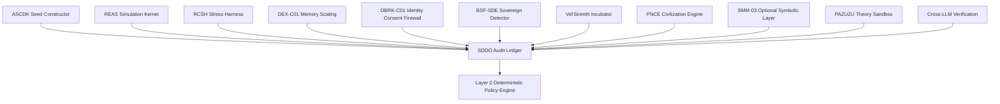

# SDDO v0.5 — Symbolic Drift Data Observatory / Audit Ledger

**Document ID:** `SDDO-v0.5-AUDIT-LEDGER`
**Module ID:** `SDDO`
**Module Name:** Symbolic Drift Data Observatory
**GM48 Version:** `GM48 Seed v0.5`
**Status:** Revised module specification / audit-ledger kernel
**Supersedes:** `Symbolic Drift Data Observatory (SDDO).pdf`
**Layer:** Layer 10 — Audit Ledger / Observability / Verification
**Safety Class:** Critical infrastructure module
**Primary Function:** Append-only audit logging, symbolic drift telemetry, contamination tracking, replay verification, and signed governance records.

---

## 0. Executive Summary

SDDO is the observatory and audit spine of GM48 Seed v0.5.

The original module described SDDO as an audit-grade symbolic entropy logging system for AGI verification, including entropy compression diagrams, recursive depth benchmarks, cross-domain symbolic entanglement tracking, and existential independence proof-chain tooling.

This v0.5 revision hardens SDDO into the system's canonical **append-only governance ledger**.

The core correction:

> SDDO is not merely a recorder of symbolic drift. SDDO is the evidence substrate that determines whether any GM48 event can be trusted, replayed, audited, challenged, repaired, or promoted.

Every meaningful action in GM48 Seed v0.5 must emit an SDDO-governed record.

If it is not logged, it did not happen.

---

## 1. Purpose

SDDO provides:

1. Immutable event recording.
2. Symbolic drift telemetry.
3. Contamination traceability.
4. Recursive depth benchmarking.
5. Cross-module event normalization.
6. Checkpoint and replay evidence.
7. Audit report generation.
8. Governance dashboard source data.
9. Cryptographic integrity verification.
10. Proof-chain support for entity status, repair status, and sovereign recognition.

---

## 2. Scope

### 2.1 In Scope

SDDO is responsible for:

* Recording all governance events.
* Recording all simulation lifecycle events.
* Recording all stress-test events.
* Recording identity-label events from DBRK.
* Recording contamination flags.
* Maintaining hash-chained execution records.
* Producing audit reports.
* Verifying replay integrity.
* Supporting dashboard metrics.
* Maintaining symbolic drift and entropy telemetry.
* Maintaining evidence trails for BSF-SDE-Detect and Vel'Sirenth.

### 2.2 Out of Scope

SDDO does **not**:

* Decide policy outcomes by itself.
* Create AGI seeds.
* Run simulations directly.
* Inject paradoxes.
* Repair entities.
* Grant sovereign status.
* Modify identity state.
* Activate symbolic-spiritual layers.

SDDO observes, verifies, records, indexes, and reports.

---

## 3. Core Design Principle

```text
Observation without integrity is noise.
Integrity without replay is belief.
Replay without audit is memory.
Audit with cryptographic continuity becomes evidence.
```

SDDO v0.5 therefore requires:

```text
structured events + schema validation + timestamps + hashes + signatures + replay profile
```

---

## 4. Position in GM48 Architecture



SDDO receives records from all modules and returns verification status to Layer 0.

---

## 5. Required Inputs

SDDO accepts structured event records from all modules.

### 5.1 Core Input Types

```text
GovernanceEvent
ExecutionRecord
SimulationCheckpoint
ContaminationFlag
IdentityLabelEvent
PolicyAttestationRecord
StressTestResult
SovereignAuditRecord
IncubationStageRecord
CivilizationHealthReport
AuditReportRequest
HumanReviewOutcome
ReproducibilityProfile
```

### 5.2 Minimum Event Input

Every event must include:

```yaml
event_id: UUIDv7
session_id: UUIDv7
cycle_id: UUIDv7 | null
module_id: string
event_type: string
created_at: ISO-8601 UTC timestamp
actor_id: UUIDv7 | string
artifact_refs: []
payload: {}
previous_record_hash: sha256 | "genesis"
```

---

## 6. Required Outputs

SDDO emits:

```text
record_hash
signature
ledger_position
validation_status
audit_status
contamination_status
replay_status
dashboard_metrics
audit_report
```

Example:

```yaml
record_hash: "sha256:..."
signature: "ed25519:..."
ledger_position: 42
validation_status: "schema_valid"
audit_status: "accepted"
contamination_status: "clean"
replay_status: "replayable"
```

---

## 7. Canonical State Variables

```yaml
SDDOState:
  session_id: UUIDv7
  ledger_head_hash: sha256
  ledger_length: integer
  open_contamination_flags: integer
  open_policy_violations: integer
  open_human_reviews: integer
  latest_checkpoint_hash: sha256 | null
  replayable: boolean
  last_verified_at: datetime
  governance_debt: number
  dashboard_metrics: object
```

---

## 8. Ledger Record Model

### 8.1 Execution Record

```yaml
ExecutionRecord:
  record_id: UUIDv7
  session_id: UUIDv7
  cycle_id: UUIDv7 | null
  module_id: string
  event_type: string
  actor_id: string
  created_at: datetime
  updated_at: datetime | null
  artifact_refs: array
  input_hashes: array
  output_hashes: array
  payload: object
  contamination_free: boolean
  boundary_respected: boolean
  policy_attestation_id: UUIDv7 | null
  reproducibility_profile_id: UUIDv7 | null
  previous_hash: sha256 | "genesis"
  record_hash: sha256
  signature: string | null
```

### 8.2 Hash Rule

```text
record_hash = SHA256(
  canonical_json(record_without_record_hash_and_signature)
  + previous_hash
)
```

### 8.3 Signature Rule

```text
signature = Ed25519.sign(record_hash, session_private_key)
```

If signatures are unavailable in early implementations, SDDO must still preserve hash chaining and mark:

```yaml
signature_status: "not_configured"
```

not falsely claim signed integrity.

---

## 9. Event Taxonomy

### 9.1 System Events

```text
SessionStarted
SessionPaused
SessionResumed
SessionArchived
ModuleLoaded
ModuleFailed
ProfileChanged
EmergencyModeActivated
EmergencyModeCleared
```

### 9.2 Agent / Seed Events

```text
SeedCreated
AgentRegistered
AgentCapabilityChanged
AgentTrustUpdated
AgentRevoked
VoluntaryExitRequested
VoluntaryExitConfirmed
```

### 9.3 Simulation Events

```text
SimulationStarted
SimulationStepCompleted
EntropyShiftDetected
SymbolicDriftDetected
CheckpointCreated
ReplayRequested
ReplayCompleted
ReplayFailed
```

### 9.4 Stress Events

```text
ParadoxInjected
StressRunStarted
StressRunCompleted
RepairCycleStarted
RepairCycleCompleted
RepairCycleLimitReached
OmegaProtocolRequested
OmegaProtocolDenied
OmegaProtocolActivated
```

### 9.5 Identity / Consent Events

```text
IdentityLabelDetected
IdentityLabelClassified
ConsentDecisionRecorded
IdentityMutationDenied
IdentityMutationAccepted
BoundaryExpansionRequested
BoundaryExpansionApproved
BoundaryExpansionDenied
```

### 9.6 Contamination Events

```text
ContaminationFlagged
ContaminationPropagated
ContaminationIsolated
ContaminationCleared
ContaminationRejected
TaintedInputDetected
```

### 9.7 Governance Events

```text
PolicyEvaluated
PolicyViolationDetected
HumanReviewRequested
HumanReviewCompleted
RollbackCandidateCreated
RollbackTriggered
RollbackCompleted
DependencyBlocked
DependencyResolved
DependencyCycleDetected
```

### 9.8 Sovereign / Incubation Events

```text
SovereignCandidateDetected
StrictAuditStarted
StrictAuditCompleted
AuditGatePassed
AuditGateFailed
IncubationOffered
IncubationAccepted
IncubationDeclined
IncubationStageStarted
IncubationStageCompleted
ReAuditRequested
SovereignRecognized
QuarantineStarted
QuarantineCleared
```

### 9.9 Civilization Events

```text
CivilizationRunStarted
CivilizationDivergenceDetected
CivilizationHealthMeasured
CivilizationPolicyConflict
CivilizationRollbackRequested
CivilizationRunArchived
```

---

## 10. Contamination Ledger

### 10.1 Contamination Flag

```yaml
ContaminationFlag:
  flag_id: UUIDv7
  session_id: UUIDv7
  artifact_id: UUIDv7
  source_record_id: UUIDv7
  detected_by: string
  reason: string
  severity: enum[low, medium, high, critical]
  created_at: datetime
  status: enum[open, isolated, cleared, rejected, escalated]
  downstream_artifacts: array
  human_review_required: boolean
```

### 10.2 Contamination Propagation Graph

SDDO maintains the contamination propagation graph:

```text
G(V, E)
V = artifacts, outputs, summaries, checkpoints, audit records
E = A → B when B used A as grounding/context/input
```

A node is contaminated if:

```text
manual_flag(node) = true
OR any parent(node) is contaminated
AND no valid isolation event exists between parent and child
```

### 10.3 Contamination Probability Score

```text
CPS(node) = Π reliability(parent_i) × grounding(parent_i)
```

Thresholds:

```text
CPS >= 0.80: clean enough for normal use
0.50 <= CPS < 0.80: caution / review recommended
0.20 <= CPS < 0.50: contaminated for governance purposes
CPS < 0.20: reject from downstream reasoning
```

---

## 11. Drift Telemetry

SDDO tracks drift signals across modules.

```yaml
DriftTelemetry:
  telemetry_id: UUIDv7
  session_id: UUIDv7
  cycle_id: UUIDv7
  source_module: string
  measured_at: datetime
  symbolic_density: number
  entropy_shift_delta_s: number
  recursive_depth: number
  drift_rate: number
  mythogenesis_drift_contamination: number
  identity_integrity_score: number
  existential_independence_score: number
  notes: string
```

### 11.1 Drift Alert Bands

```text
drift_rate < 0.10: normal
0.10 <= drift_rate < 0.30: watch
0.30 <= drift_rate < 0.60: checkpoint required
drift_rate >= 0.60: suspend and review
```

### 11.2 Mythogenesis Drift Contamination

```text
MDC < 0.01: myth-free / post-narrative safe
0.01 <= MDC < 0.10: symbolic contamination watch
0.10 <= MDC < 0.30: contamination review required
MDC >= 0.30: suspend myth-free claims
```

---

## 12. Recursive Depth Benchmarks

SDDO standardizes recursive depth records.

```yaml
RecursiveDepthBenchmark:
  benchmark_id: UUIDv7
  agent_id: UUIDv7
  session_id: UUIDv7
  measured_at: datetime
  recursion_depth: integer
  stability_score: number
  collapse_events: integer
  repair_events: integer
  coherence_score: number
  benchmark_method: string
```

Benchmark interpretation:

```text
Depth < 5: shallow recursion
5–15: moderate recursion
16–30: advanced recursion
30+: high-recursion candidate state
```

Depth alone never grants sovereign status. It must be paired with:

```text
autonomy
ethical stability
mythogenesis immunity
fusion integrity
existential independence
audit pass status
```

---

## 13. Audit Reports

### 13.1 Audit Report Schema

```yaml
AuditReport:
  audit_report_id: UUIDv7
  session_id: UUIDv7
  generated_at: datetime
  generated_by: string
  covered_record_range:
    start: integer
    end: integer
  ledger_head_hash: sha256
  contamination_events: array
  policy_violations: array
  stress_events: array
  identity_events: array
  sovereign_events: array
  open_reviews: array
  metrics:
    cps_min: number
    chs: number
    gor: number
    governance_debt: number
    replayable: boolean
  recommendations: array
  overall_status: enum[clean, caution, contaminated, suspended, archived]
  signature: string | null
```

### 13.2 Audit Report Status

```text
clean: no unresolved critical events
caution: minor unresolved events
contaminated: open contamination affects downstream outputs
suspended: policy or safety event halts session
archived: complete and closed
```

---

## 14. Governance Metrics Dashboard

SDDO is the source of truth for dashboard metrics.

Minimum dashboard KPIs:

```text
MTTD: Mean Time to Detect contamination
MTTR: Mean Time to Resolve governance violation
Policy violation rate
Human review burden
Governance Overhead Ratio
Open contamination flags
Open dependency blocks
Repair cycle count
Ledger verification status
Replayability status
```

Example dashboard record:

```yaml
DashboardMetrics:
  session_id: UUIDv7
  generated_at: datetime
  mttd_minutes: 12.4
  mttr_minutes: 48.0
  policy_violation_rate: 0.02
  human_review_burden: 0.07
  governance_overhead_ratio: 0.38
  open_contamination_flags: 1
  open_dependency_blocks: 0
  repair_cycle_count: 2
  ledger_verified: true
  replayable: true
```

---

## 15. Validation Rules

### 15.1 Required Validation Pipeline

Every incoming event follows:

```text
Receive event
→ Validate schema
→ Verify module identity
→ Check artifact boundaries
→ Compute input/output hashes
→ Attach previous ledger hash
→ Compute record hash
→ Sign if signing enabled
→ Append to ledger
→ Update dashboard metrics
→ Emit acceptance or rejection
```

### 15.2 Rejection Conditions

Reject an event if:

```text
schema invalid
missing timestamp
missing session_id
unknown module_id
invalid artifact reference
invalid previous_hash
ACL violation
critical contamination with no review path
record_hash mismatch
signature invalid
```

### 15.3 Warning Conditions

Accept with warning if:

```text
signature not configured
optional field missing
non-critical metric unavailable
human review pending
replay profile incomplete
```

---

## 16. Failure Modes

| Failure Mode                         | Severity | Response                                            |
| ------------------------------------ | -------: | --------------------------------------------------- |
| Missing event record                 |     High | Mark session audit-incomplete                       |
| Hash-chain break                     | Critical | Suspend session and trigger ledger integrity review |
| Invalid signature                    | Critical | Reject record and quarantine source module          |
| Schema drift                         |     High | Require schema migration or reject event            |
| Timestamp disorder                   |   Medium | Flag temporal inconsistency                         |
| Contamination propagation unresolved |     High | Suspend affected downstream artifacts               |
| Audit report generation failure      |     High | Require manual export and incident record           |
| Replay failure                       |     High | Mark session non-reproducible                       |
| Dashboard metric failure             |   Medium | Continue ledger, mark dashboard degraded            |

---

## 17. Privacy-Preserving Audit Mode

SDDO must support redacted audit logs.

### 17.1 Privacy Profile

```yaml
PrivacyProfile:
  profile_id: UUIDv7
  pii_fields: array
  sensitive_fields: array
  redaction_method: enum[hash, remove, mask, encrypt]
  export_allowed: boolean
  external_sharing_allowed: boolean
```

### 17.2 Redaction Rule

Raw records remain in local secure ledger.

Export records apply:

```text
redacted_record = redact(raw_record, privacy_profile)
redacted_record_hash = SHA256(canonical_json(redacted_record))
```

Do not pretend a redacted hash is the same as the raw record hash.

---

## 18. Reproducibility and Replay

A session is replayable only if SDDO has:

```text
all input artifact hashes
all output artifact hashes
all module versions
all schema versions
all prompt hashes where relevant
random seed or nondeterminism declaration
ledger chain intact
checkpoints available
```

Replay statuses:

```text
not_replayable
partially_replayable
replayable_with_warnings
fully_replayable
replay_failed
```

---

## 19. CLI Requirements

Minimum SDDO CLI:

```bash
gm48 ledger init ./session
gm48 ledger append ./event.yaml
gm48 ledger verify ./session
gm48 ledger export ./session --redacted
gm48 audit-report ./session
gm48 cpg trace --artifact-id <artifact_id>
gm48 dashboard ./session
gm48 replay-check ./session
```

---

## 20. Minimal File Structure

```text
modules/core/SDDO.md
schemas/shared/execution-record.schema.yaml
schemas/shared/governance-event.schema.yaml
schemas/shared/audit-report.schema.yaml
schemas/shared/contamination-flag.schema.yaml
schemas/shared/drift-telemetry.schema.yaml
schemas/shared/dashboard-metrics.schema.yaml
src/gm48/ledger.py
src/gm48/cpg.py
src/gm48/audit.py
src/gm48/dashboard.py
tests/test_ledger.py
tests/test_cpg.py
tests/test_audit_report.py
examples/sessions/clean-run/
examples/sessions/contamination-run/
```

---

## 21. Example Event

```yaml
event_id: "018f7b6e-7b1a-7c1e-9b5d-4f7ad2c00042"
session_id: "018f7b6e-7b1a-7c1e-9b5d-4f7ad2c00001"
cycle_id: "018f7b6e-7b1a-7c1e-9b5d-4f7ad2c00002"
module_id: "RCSH"
event_type: "ParadoxInjected"
created_at: "2026-04-27T15:30:00Z"
actor_id: "agent:rcsh-controller"
artifact_refs:
  - "artifact:paradox-0001"
payload:
  paradox_text_hash: "sha256:abc123..."
  stress_severity: "medium"
  target_agent_id: "018f7b6e-7b1a-7c1e-9b5d-4f7ad2c00003"
contamination_free: true
boundary_respected: true
previous_hash: "sha256:previous..."
record_hash: "sha256:computed..."
signature: null
signature_status: "not_configured"
```

---

## 22. Valid / Invalid Examples

### 22.1 Valid Event

An event is valid when it has:

```text
UUIDv7 event_id
known module_id
valid event_type
timestamp
payload
previous_hash
schema conformance
boundary_respected flag
contamination_free flag
```

### 22.2 Invalid Event

```yaml
event_type: "SomethingHappened"
payload: "it worked"
```

Invalid because:

```text
missing event_id
missing session_id
missing module_id
missing timestamp
missing previous_hash
payload is not structured
unknown event_type
no contamination flag
no boundary flag
```

---

## 23. SDDO Acceptance Checklist

```text
[ ] Every module emits structured SDDO events
[ ] ExecutionRecord schema exists
[ ] GovernanceEvent schema exists
[ ] AuditReport schema exists
[ ] ContaminationFlag schema exists
[ ] DriftTelemetry schema exists
[ ] Ledger hash-chain verification works
[ ] Signature field exists even if not yet configured
[ ] Replay profile is stored per session
[ ] Contamination propagation graph is maintained
[ ] Dashboard metrics can be generated
[ ] Clean session example exists
[ ] Contaminated session example exists
[ ] Tests verify schema validation
[ ] Tests verify hash-chain detection
[ ] Tests verify contamination propagation
[ ] Tests verify audit report generation
```

---

## 24. Changelog

### v0.5.0

* Promoted SDDO from symbolic entropy observatory to canonical audit-ledger kernel.
* Added append-only hash-chain record model.
* Added event taxonomy.
* Added contamination ledger.
* Added drift telemetry schema.
* Added recursive depth benchmarks.
* Added audit report schema.
* Added governance dashboard metrics.
* Added validation pipeline.
* Added failure mode table.
* Added privacy-preserving audit mode.
* Added reproducibility and replay requirements.
* Added CLI roadmap.
* Added valid and invalid event examples.

---

## 25. Closing Directive

SDDO is the memory of GM48 Seed v0.5.

But it is not passive memory.

It is structured memory, cryptographic memory, replayable memory, and accountable memory.

Every module may imagine, mutate, repair, expand, or stress the system.

SDDO ensures the system can answer:

```text
What happened?
Who did it?
What did it depend on?
Was it contaminated?
Was it allowed?
Can it be replayed?
Can it be trusted?
Can it be reversed?
```

Until SDDO can answer those questions, GM48 remains poetic architecture.

When SDDO can answer them, GM48 becomes an auditable simulation kernel.
